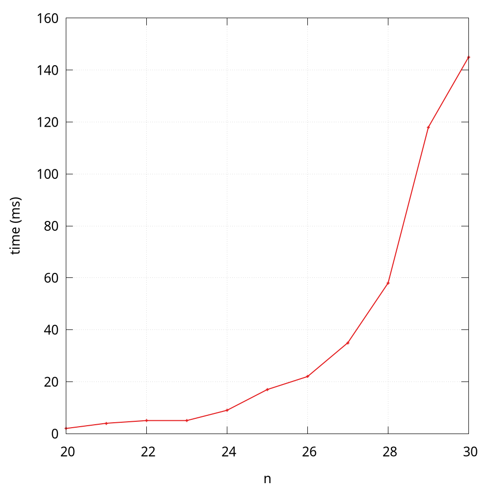

# Algorithm Analysis
How fast is a program?[^fast] If the (time) efficiency is our major concern, then we have to ask this question regularly.

## A hands-on method
A straightforward way is to measure the elapsing time. In the following, we will use a tiny program ([Fibonacci.java](https://github.com/ChenZhongPu/data-structure-swufe/tree/master/code/java/start/src/Fibonacci.java) and [fibonacci.py](https://github.com/ChenZhongPu/data-structure-swufe/tree/master/code/python/start/fibonacci.py)) to compute the nth fibonacci number.

### Java
In Java, there are many APIs available in terms of time/date, including `System.currentTimeMillis()`, `Instant.now`. You can use either of the following method[^java-time] to compute the elapsing time in milliseconds:

```java
long start = System.currentTimeMillis();
// your program runs
long end = System.currentTimeMillis();
long elapse = end - start;
```

```java
long start = Instant.now().toEpochMilli();
// your program runs
long end = Instant.now().toEpochMilli();
long elapse = end - start;
```

```java
Instant start = Instant.now();
// your programs runs
Instant end = Instant.now();
long elapse = Duration.between(start, end).toMillis();
```

> A more robust and comprehensive approach in Java is to use [JMH](https://github.com/openjdk/jmh), and the usage of it is out of the scope of this book.

### Python
In Python, several modules can be used to deal with time/date, including `time`, `datetime`. But note that `time.time()` returns a float number representing the current time in seconds since the Epoch. You can use either of the following code to compute the elapsing time in milliseconds:

```python
start = int(round(time.time() * 1000))
# your program runs
end = int(round(time.time() * 1000))
elapse = end - start
```

```python
start = datetime.datetime.now()
# your program runs
end = datetime.datetime.now()
elapse = int(round((end - start).total_seconds() * 1000))
```

Generally, to avoid the variability of the running time, we usually run the program for several times and then take the average. Luckily, the built-in [timeit](https://docs.python.org/3/library/timeit.html) makes it simple. 

## Visualize the efficiency
Sometimes, we would like to visualize the quantitative measurements of the running time of our programs. A common qualitative observation about most programs is that there is a *problem size*
that characterizes the difficulty of the computational task. For example, `fibonacci(30)` will definitely coast more time than `fibonacci(3)`. Here the parameter (i.e., `3` and `30`) can be seen as the problem size.

A simple way is to save *(size, time)* per line in a file ([FibTime.java](https://github.com/ChenZhongPu/data-structure-swufe/tree/master/code/java/start/src/FibTime.java) and [fib_time.py](https://github.com/ChenZhongPu/data-structure-swufe/tree/master/code/python/start/fib_time.py)), and then to visualize results using tools like [gnuplot](http://www.gnuplot.info/), [ggplot2 in R](https://ggplot2.tidyverse.org/), [Matplotlib in Python](https://matplotlib.org/), and [Plotly Express in Python](https://plotly.com/python/plotly-express/).

> Many people tend to plot the data from the memory directly, but plotting the data from a file is more common in practice. Therefore, we deliberately separate the data computing and plotting in this book.

Here I use the Python version as the example:

```python
if __name__ == '__main__':
    ns = [20, 21, 22, 23, 24, 25, 26, 27, 28, 29, 30]
    with open('fib_python.txt', 'w') as f:
        for n in ns:
            start = int(round(time.time() * 1000))
            fibonacci(n)
            end = int(round(time.time() * 1000))
            f.write(f'{n}   {end - start}\n')
```

Note that here the problem size starts from `20`, because the time is near to 0 when the problem size is less than 20.



According to the observation[^fig], some students may quickly make an insightful hypothesize that the running time is at an exponential growth, and I will analyze it through a mathematical model soon. By the way, the Java version of Fibonacci is much faster than the Python version.


## Mathematical models
D.E. Knuth postulated that, despite all the complicating factors in understanding the running times of our programs, it is possible, in principle, to build a mathematical model to describe the running time of any program. Knuth’s basic insight is simple: the total running time of a program is determined by two primary factors:

- The cost of executing each statement
- The frequency of execution of each statement

The former is a property of the computer and the language itself, and the second one is a property of the program and the input. The primary challenge is to determine the frequency of execution of the statements. Here are some examples:

```python
def foo(n):
    for i in range(n):
        print(i)
```

The frequency of the inner statement of this function is *n*.

Sometimes, frequency analysis can lead to complicated and lengthy mathematical expressions. Consider the [two-sum](https://leetcode.com/problems/two-sum/) problem, and the following is a naive solution:

```python
class Solution:
    def two_sum(self, nums, target):
        for i, v in enumerate(nums):
            for j in range(i + 1, len(nums)):
                if v + nums[j] == target:
                    return [i, j]
        return []
```

The frequency of the inner comparison test statement of this function is *(n-1) + (n-2) + ... + 1* in the worst case:

\\[ \frac{n \times (n-1)}{2} = \frac{n^2 - n}{2} \\]

Curious readers can try to implement a faster algorithm for this problem[^two-sum]. Note that here I put emphasis on *the worst case*, because if you are lucky enough, the sum of the first and second item equals target, then the frequency in the *best* case is only 1.

As for the notation \\(\frac{n^2 - n}{2}\\), we can know that it is the \\(\frac{n^2}{2}\\) that plays a major rule in terms of the growth, so we can say \\(\frac{n^2}{2}\\) approximates to \\(\frac{n^2 - n}{2}\\). In addition, when it comes to the order of growth, the constant here (i.e., 1/2) is also insignificant. The following shows some typical approximations:

| Function | Approximation |  Order of growth
|---------|---------|------ |
| \\(N^3/6 - N^2/2 + N/3\\)     | \\(N^3/6\\)     |  \\(N^3\\) |
| \\(N^2/2 - N/2\\) | \\(N^2/2\\) | \\(N^2\\) |
| \\(lg{N} + 1\\) | \\(lg{N}\\) | \\(lg{N}\\) |
| 3 | 3 | 1 |

The order of growth in the worst case can be also described by the [big *O* notation](https://en.wikipedia.org/wiki/Big_O_notation), e.g., \\(O(n^3)\\). The following shows some commonly encountered time complexity using the big *O* notation:

| Description | Time complexity |
| ------------ | ---------|
| constant | \\(O(1)\\) |
| logarithmic | \\(O(log{N})\\) |
| linear | \\(O(N)\\) |
| linearithmic | \\(O(N\log{N})\\) |
| quadratic | \\(O(N^2)\\) |
| cubic | \\(O(N^3)\\) |
| exponential | \\(O(2^N\\)) |

For example, we can say

- the complexity of `foo()` is \\(O(N)\\)
- the complexity of `two_sum()` is \\(O(N^2)\\)

### Case study: Fibonacci
Based on the observation, we make an insightful hypothesize that the running time of recursive implementation `fibonacci` is at an exponential growth. 

According to the code, we know that in order to computer `fibonacci(n)`, it is required to compute `fibonacci(n - 1)` and `fibonacci(n - 2)`. If we use \\( T(n) \\) to denote the time used to compute `fibonacci(n)`, then we have:

\\[T(n) = T(n-1) + T(n-2) + O(1)\\]

The \\(O(1)\\) here means the addition operation. You can prove that \\(T(n) = O(2^n)\\)[^fib], and the visualization plotting also validates this theoretical result.

---
[^fast] Another important question is "Why does my program run out of memory?", which cares about the space efficiency.

[^java-time] See more at https://stackoverflow.com/questions/58705657/.

[^fig] This figure is drawn by [gnuplot](http://www.gnuplot.info/) and the code can be found at [lines.gp](https://github.com/ChenZhongPu/data-structure-swufe/tree/master/code/plot/lines.gp).

[^two-sum] It is possible to design [faster algorithms](https://www3.cs.uic.edu/pub/CS211/LabsS18/Two-Sum.pdf) with \\( O(N\log{N}) \\) and even with \\( O(N) \\).

[^fib] See more at https://www.geeksforgeeks.org/time-complexity-recursive-fibonacci-program/.
