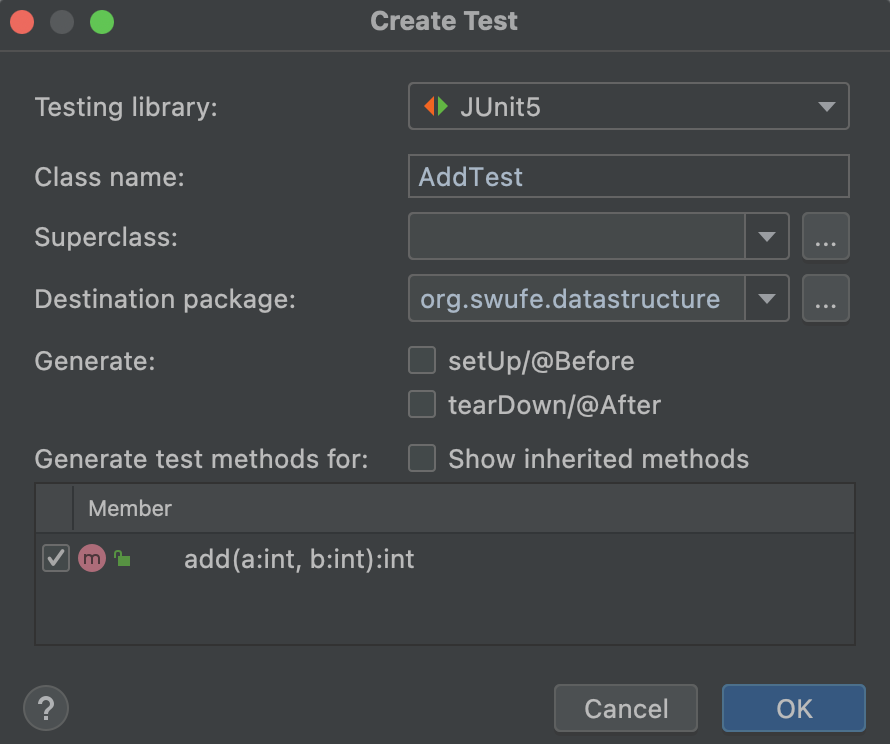

# Test Driven Development
Correctness in our programs is the extent to which our code does what we intend it to do. So, how can we guarantee that our code is correct?

Let's consider that Fibonacci sequence program again. Most beginners would adopt the traditional *print-check* method manually.

```python
print(fibonacci(0)) # expect: 0
print(fibonacci(1)) # expect: 1
print(fibonacci(2)) # expect: 1
print(fibonacci(3)) # expect: 2
print(fibonacci(4)) # expect: 3
print(fibonacci(5)) # expect: 5
...
```

But this method is somewhat inefficient, let alone being automatic. In this section, I will introduce a better approach.

## Assert
An assertion allows testing the correctness of any assumptions that have been made in the program, and once an `assert` fails, the program will crash. So, assertions can be used for testing. See more at [Assertions in Java](https://www.geeksforgeeks.org/assertions-in-java/) and [Python's assert](https://realpython.com/python-assert-statement/).

### Java

```java
Fibonacci f = new Fibonacci();
assert f.fibonacci(5) == 5;
```

And you can even provide additional message for an assertion: 

```java
assert f.fibonacci(5) == 5 : "Error when n is 5";
```

Note that you need to add `-ea` option to enable assertions. In Intellij IDEA, it can be set in `Run > Edit Configurations... > Configuration > VM options`.

### Python

```python
assert fibonacci(5) == 5
```

And you can even provide additional message for an assertion: 

```python
assert fibonacci(5) == 5, 'Error when n is 5'
```

## Unit tests

> Testing is a complex skill: we can’t cover every detail about how to write good tests.

For modern software engineering, the test driven development (TDD) is widely adopted, and unit tests serve as an essential component in TDD. To put it simply, the key points of TDD include:

- **Write tests before real implementations**. It may sound ridiculous, but it is feasible as long as you can determine the *input* and expected *output* of a program. As for the Fibonacci sequence, we can expect that `fibonacci(5)` equals 5 before implementing the code.
- **Write tests for every public API**. Here the *every* implies *unit*; in other words, we shall make sure *every* API works as we expect. 
- **Isolate tests from core code**. The naive assertions[^debug] are often messed with the core code, but unit tests are placed separately. This feature is very productive for teamwork, as developers and testers are able to cooperate with each other smoothly.

Due to the importance of unit tests, I will use unit tests when designing data structures throughout this book from now on. 
### Java
There are several awesome unit testing frameworks for Java, and the most popular one is [JUnit 5](https://junit.org/junit5/). In order to integrate this third library in our project, we are going to use `gradle` as the build system to facilitate our work. Please refer to [Appendix](../appendix/java.md) for more information.

In [Add.java](https://github.com/ChenZhongPu/data-structure-swufe/tree/master/code/java/unit-work/src/main/java/org/swufe/datastructure/Add.java), we have provided a simple method for two numbers' addition:

```java
public class Add {
    public int add(int a, int b) {
        return a + b;
    }
}
```

Now let's create a unit test for `add()`. Please move the cursor onto `add()`, and then right-click *Go to | Test ｜ Create New Test*.


Check the `add()` method:



It will create an [AddTest.java](https://github.com/ChenZhongPu/data-structure-swufe/tree/master/code/java/unit-work/src/test/java/org/swufe/datastructure/AddTest.java) under the `test` folder for yor:

```java
@Test
void add() {
    Add a = new Add();
    assertEquals(a.add(1, 2), 3);
}
```

We can add as many test cases as we like:

```java
@Test
void addTwoNegatives() {
    Add a = new Add();
    assertEquals(a.add(-2, -2), -4);
}
```

A test case can be either *passed* or *failed*. If all test cases are passed, we can somewhat ensure that this program works as we expected[^bug]. Otherwise, it indicates that there is some bugs in our code, and we should fix them before moving on. The comprehensive usage of `JUnit 5` is out of the scope of this book, readers can refer to [A Guide to JUnit 5](https://www.baeldung.com/junit-5) for a quick start.

By the way, all assertions are enabled when executing the unit tests.

### Python
Luckily, the [unittest](https://docs.python.org/3/library/unittest.html) module is built with Python, so we do not have to rely on any third-party library[^pytest].

As for [add.py](https://github.com/ChenZhongPu/data-structure-swufe/tree/master/code/python/start/add.py), we can also follow the steps: move the cursor onto `add()`, and then right-click *Go to | Test ｜ Create New Test*. Finally, it will create `test_add.py` for us, and we can add as many test cases as we like: 

```python
from unittest import TestCase
import unittest
from add import add


class Test(TestCase):
    def test_add(self):
        self.assertEqual(add(2, 1), 3)

    def test_add_negatives(self):
        self.assertEqual(add(-2, -2), -4)


if __name__ == '__main__':
    unittest.main()
```

---
[^debug] Part of the reason stems from the fact that assertions have multiple applications. In addition to tests, assertions also can be used to debug code. 

[^bug] Edsger W. Dijkstra said that “Program testing can be a very effective way to show the presence of bugs, but it is hopelessly inadequate for showing their absence.” That doesn’t mean we shouldn’t try to test as much as we can!

[^pytest] A third-party test library, called [pytest](https://docs.pytest.org/en/7.1.x/), is more powerful than the `unittest` module in the standard library.