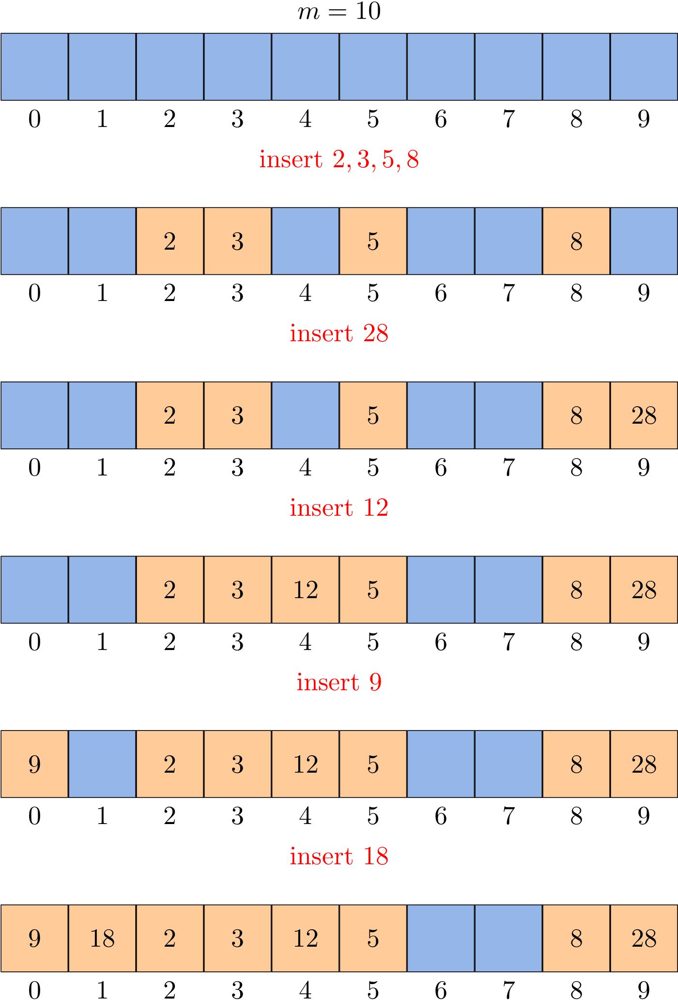

# Open-addressing Hashing
Another approach to implementing hashing is to store *n* elements in a hash table of size *m > n*, relying on empty entries in the table to help with collision resolution. Such method are called **open-addressing** hashing methods. Unlike chaining, it does not make use of storage outside the hash table itself. One consequence is that the load factor \\(\alpha\\) can never exceed 1.

Collisions are handled as follows: when a new element is to be inserted into the table, it is placed in its "first-choice" location if possible. If that location is already occupied, the new element is placed in its "second-choice" location. The process continues until an empty slot is found in which to place the new element.

## Linear probing
The simplest open-addressing method is called **linear probing**. It is characterized by identifying three possible outcomes:

- Key equal to search key: search hit
- Empty position (`null` key): search miss
- Key not equal to search key: try next entry

Given a *h(k)*, we can define the hash function for linear probing as

\\[h(k, i) = (h(k) + i) \ mod \ m\\]

for \\(i = 0, 1, \dots, m - 1\\).



### General design
Since a set can be regarded as a map whose values are always `null`, we start to use both keys and values in this more practical design. As for a linear probing hash map, it maintains:

- an array of `keys`
- an array of `values` (*satellite data*)
- number of key-value pairs in the table: `n`
- size of linear-probing table: `m`

The complete code can be found at [LinearProbeHash.java](https://github.com/ChenZhongPu/data-structure-swufe/blob/master/code/java/hash/src/main/java/org/swufe/datastructures/LinearProbeHash.java) and [linear_probe_hash.py](https://github.com/ChenZhongPu/data-structure-swufe/blob/master/code/python/hash/linear_probe_hash.py).

### `put()`


This is a classical **do-while** loop. In real implementations, we can always guarantee that *m > n* by `resize()`. As a result, "hash table overflow" will never happen.

In Java, you can also translate it into a regular `for` loop:

```java
public void put(Key k, Value v) {
    int i;
    for (i = hash(k); keys[i] != null; i = (i + 1) % m) {
        if (keys[i].equals(k)) {
            values[i] = v;
            return;
        }
    }
    keys[i] = k;
    values[i] = v;
    n++;
}
```

### `get()`


Readers can try to implement it using *while* or *do-while* structure. The following alternative using *for* is more readable because `null` always exists:

```java
public Value get(Key k) {
    for (int i = hash(k); keys[i] != null; i = (i + 1) % m) {
        if (keys[i].equals(k)) {
            return values[i];
        }
    }
    return null;
}
```

### `delete()`
How do we delete a key-value pair from a linear-probing table? If you think about the situation for a moment, you will see that setting the key's table position to `null` will not work, because that might prematurely terminate the search for a key that was inserted into the table later. For example, to delete 28, if we simply set position 9 to `null`, then `get()` cannot find either 18 or 9.


The solution is to rehash all keys after the deleted position until we encounter a `null`.


By the way, Lines 1-10 also provides another method to find a key.

### `resize()`
If the size of key-value pairs is greater/less than some threshold, we can call the `resize()`, where it is necessary to rehash all keys, for *m* is changed.

### Analysis of linear probing
Precise analysis of linear probing is a very challenging task. Knuth developed a landmark formulas in 1962:

> In a linear probing hash table with \\(m\\) lists and \\(n = \alpha m\\) keys (\\(\alpha < 1\\)), the average number of probes required is
> \\[\frac{1}{2}\left( 1 + \frac{1}{1 - \alpha}\right) \ and\ \frac{1}{2}\left( 1 + \frac{1}{(1 - \alpha)^2}\right) \\]
> for search hits and search misses (inserts), respectively.

In particular, when \\(\alpha\\) is about 1/2, the average number of probes for a search hit is about 3/2 and for a search miss is about 5/2. Therefore, as long as we can make sure the hash table is half-full, the performance is generally good.

## A few notes on Python's implementation
It is fine to implement `get()` and `put()`, as we did in Java, but it would be more Pythonic to implement methods:

```python
def __setitem__(self, key, value):
    pass

def __getitem__(self, key):
    pass

def __delitem__(self, key):
    pass
```

The same techniques can also be applied for a BST, when the satellite data (i.e., values) are also stored. In this way, we can use the following code:

```python
table = LinearProbeHash()
table[1] = '1'
table[2] = 'two'
print(table[1])
del table[1]
```