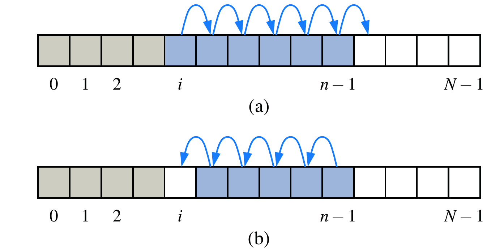

# ArrayList
One popular implementation of the list ADT is *array* based, which we have used it before. So, what is an array exactly?

> An array is a linear data structure that collects elements of the same data type and stores them in contiguous and adjacent memory locations. 

There are two key points about elements in an array:

- The same type.
- Contiguous in memory.

By this definition, Python's `list` is not an array[^array] because it can hold elements with mixing types. Those two features result in pros and cons at the same time.

- It is very efficient for index-based accessor methods.
- It can be time-consuming when shifting or copying is required (e.g., `dequeue()` in array-based queue, and `resize()`). 

The figure[^shift] above illustrates (a) shifting up for an insertion at index *i*; (b) shifting down for a removal at index *i*.

Once you have grasped the usages of an array, you are able to implement your own *ArrayList* in Java, and this is left as an exercise.

## Pseudo code
Previously, we use either plain English or a specific programming language to describe an algorithm, but it lacks of generality to some extent. This is because data structures and algorithms can be virtually written in all programming languages[^lan]. Therefore, we are seeking for a more general approach. The plain English is a candidate method, but it is overly verbose. More importantly, it is not accurate. 

In this subsection, we will going to study the pseudo-code programming. The term *pseudo-code* refers to an informal, English-like notation for describing how an algorithm, a method, a class, or a program will work.

Pseudo-code is written using English-like statements, so target language coding details should be avoided if possible. On the other hand, common language elements such `if`, `for` and `return` can be used to used. Even, some common operations of well known ADT can also be adopted to simplify the statements (e.g., `push()`, `size()`).

> There is no standard about how to write pseudo code. In this book, we will mainly follow the styles in [algorithm2e](https://www.ctan.org/pkg/algorithm2e).

### Example: `indexOf(a, o)`

How to implement the `indexOf(a, o)` method of an `ArrayList`? For the ease of description, we assume the *array* itself is the first parameter `a`. Let's describe this simple algorithm in pseudo code:

As we can see, a well-written pseudo code is easy to read and understand. In this way, programmers with different background can write this algorithm in their favorite languages.

### Example: selection sort
Let's have a look at one of the simplest sorting methods for arrays[^sort]. The objective of the sorting algorithm is to rearrange the items such that their keys are ordered according to some well-defined ordering rule (usually numerical or alphabetical order).

> Both Java and Python provide built-in sorting algorithms for collections.

It works as follows: First, find the smallest item in the array and exchange it with the first entry (itself if the first entry is already the smallest). Then, find the next smallest item and exchange it with the second entry. Continue in this way until the entire array is sorted. This method is called **selection sort** because it works by repeatedly selecting the smallest remaining item.

The following is the pseudo code for selection sort. Readers can try to implement this algorithm using Java or Python, and this is left as an exercise.

Note that here we used an English statement to describe the swapping operation in line 9.

---
[^array] Python's [array](https://docs.python.org/3/library/array.html) module can compactly represent an array of basic numeric values.

[^shift] This figure is from *Data Structures and Algorithms in Java*.

[^lan] Of course, different programming languages have their unique features, and thus the detailed implementation may differ from each other greatly.

[^sort] We will explore sorting comprehensively in [Sortings](../sorting/intro.md).