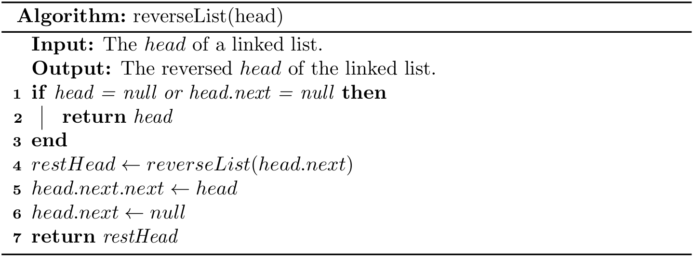

# Case Study

## Array vs. Linked List

> Different from an array based list, a linked list can be stored in non-contiguous memory, so this ADT performs well when we insert or remove an element at some position in a list because no any shifting is required. Of course, it has trade-offs. Since it is not contiguous, index-based retrieving is less efficient for a linked list ADT, because we have to scan the whole list at the worst case.

We can use either an *array* or *linked list* to implement common data structures such as *stacks* and *queues*. More importantly, there is not a one-size-fits-all solution, as each offers distinct advantages and disadvantages. When choosing between these two representations, you shall ask **which operations (*add/remove/index*) are concerned in your applications**. In addition, memory overhead can also be an important factor sometimes.

## Reverse a linked list
As the last subsection of this chapter, we will investigate how to reverse a linked list which is a frequently-asked question in job interviews.

> Different from the ADT described in an object-oriented way, a linked list is usually presented as its *head*.

### LeetCode 206. Reverse Linked List
Given the `head` of a singly linked list, reverse the list, and return the *reversed list*.


We use a typical *two-pointers* strategy to maintain the previous (`pre`) and current (`cur`) node while scanning the list. Readers shall pay attention to how we update the links between nodes.

In fact, this problem can also be solved using **recursion**[^recursive], which is a profound programming skill, and we will use it frequently for algorithms in *trees*. To put it simply, *recursion means "defining a problem in terms of itself".*

For example, how to compute the sum of a list? Let's use Python to describe the solution due to its slicing capability[^sum].

```python
def sum_of_list(a):
    s = 0
    for i in a:
        s += i
    return s
```

Note that a list can also be defined in a recursive way. For instance, `[1, 2, 3, 4]` is made up with one item (`1`) and a shorter list (`[2, 3, 4]`); and `[2, 3, 4]` can be further decomposed. Therefore, a recursion implementation is:

```python
def sum_of_list(a):
    if len(a) == 0:
        return 0
    return a[0] + sum_of_list(a[1:])
```

As we can see, `sum_of_list()` is called within `sum_of_list()`. When designing a recursive algorithm, you shall keep in mind a fact that there are **base cases** (i.e., when to stop). By the way, the tiny program ([Fibonacci.java](https://github.com/ChenZhongPu/data-structure-swufe/tree/master/code/java/start/src/Fibonacci.java) and [fibonacci.py](https://github.com/ChenZhongPu/data-structure-swufe/tree/master/code/python/start/fibonacci.py)) we used in [Algorithm Analysis](../fundamentals/alg.md) is also a classical recursion.

Now let's design a recursive alternative to reverse a linked list.



Last but not the least, although recursions make code much clearer, recursive algorithms often have more cost in terms of space and time compared with their iterative counterparts. This is because recursions result in larger calling stacks[^stack]. Again, this is a *trade-off* again; sometimes we would prefer a shorter piece of code by giving up some performance.

The complete code can be found at [LeetCode206.java](https://github.com/ChenZhongPu/data-structure-swufe/tree/master/code/java/lists/src/main/java/org/swufe/datastructure/LeetCode206.java) and [leet_code_206.py](https://github.com/ChenZhongPu/data-structure-swufe/tree/master/code/python/lists/leet_code_206.py).

---
[^recursive] Recall that a linked list itself can be defined recursively.

[^sum] You don't really have to design a method to compute a sum, because we can use the built-in `sum()` method directly in Python.

[^stack] Some algorithms are called **tail recursive** because the last statement in the algorithm is to "restart" the algorithm. Tail recursive algorithms are usually translated into loops by most compilers, so there is not any efficiency deficit in runtime. See more at [What is tail recursion?](https://stackoverflow.com/questions/33923/).