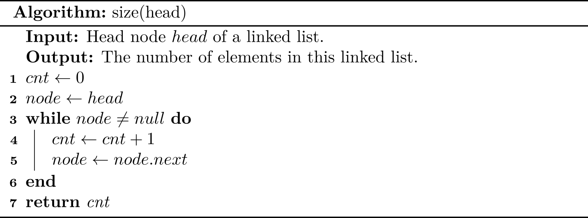
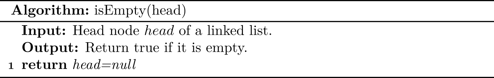
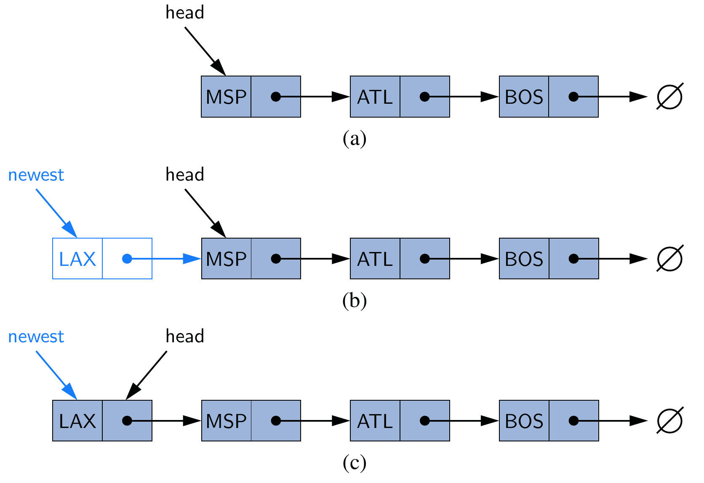
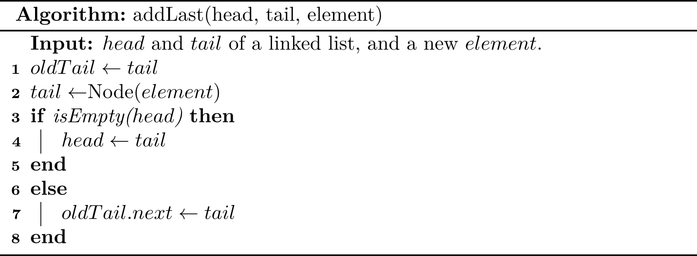

# LinkedList
Different from an array based list, a linked list can be stored in non-contiguous memory, so this ADT performs well when we insert or remove an element at some position in a list because no any shifting is required. Of course, it has trade-offs. Since it is not contiguous, index-based retrieving is less efficient for a linked list ADT, because we have to scan the whole list at the worst case.

A typical illustration of a (singly) linked list is like:


> Our implementation serves as a model for the code that we use for building
more complex data structures throughout the book, so you should read this section
carefully, even if you have experience working with linked lists.

As we can see, a linked list consists of a sequence of *nodes*, and the previous node has a link pointing to the next one. The following is working definition for linked lists:

> A linked list is a **recursive** data structure that is either empty (`null`) or a
reference to a node having an item and a reference to a linked list.

With object-oriented programming, implementing linked lists is not difficult. We start with a class that defines the node abstraction:

```java
class Node {
    Item item;
    Node next;
}
```

```python
class Node:
    def __int__(self, item, next=None):
        self.item = item
        self.next = next
```

As for the linked list shown in the figure, we can use the following code:

```python
first = Node(1)
second = Node(9)
third = Node(8)
first.next = second
second.next = third
```

From the definition, we can know that one is able to use the first node (`first` in our case) to represent a whole linked list, and the first node often is known as `head`. As for the procedure-oriented programming language (e.g., C), this is only  way to design a linked list.

To what follows, I will describe the common methods for a linked list ADT in a procedure-first way, and we are going to translate those pseudo code into Python or Java code in the following sections. 

## `size()`: the number of elements

The idea is straightforward: scanning the linked list from `head`, and stop util we reach a `null`.



In practice, this method is not necessary due to its inefficiency (\\(O(N)\\)), and we can store its size an attribute directly. Since adding a `size` is trivial, and for the ease of description, we will not show how to use and update `size` attribute in the pseudo code.

## `isEmpty()`: return true if there is no any element

One solution is to check whether its size is 0. The following shows an equivalent approach with the constant time complexity:



## `addFirst()`: add an element at the beginning

The main idea is that we create a new node with the new element, set its `next` link to refer to the current `head`, and set the list’s `head` to point to the new node.



This figure illustrates (a) before the insertion; (b) after a new node is created and linked to the existing head; (c) after reassignment of the head reference to the newest node.


Recall that adding an element to an array cost \\(O(n)\\), but this algorithm costs only \\(O(1)\\).

## `addLast()`: add an element at the end
The last position is also known as `tail`. If the linked list also maintains the `tail` node, then the implementation is trivial: just update the `tail` reference itself to the newly created node. 


But we have to consider another corner case: **when the linked list is empty, both `head` and `tail` is null, so it is illegal to use `tail.next = newest`**.



> We need to care about whether a node is null when designing algorithms for linked list ADT.

Additionally, if we introduce a `tail` for a linked list, the algorithm for adding an element should be updated accordingly. Readers can also explore how to add an element at the end of a linked list if `tail` is not stored.