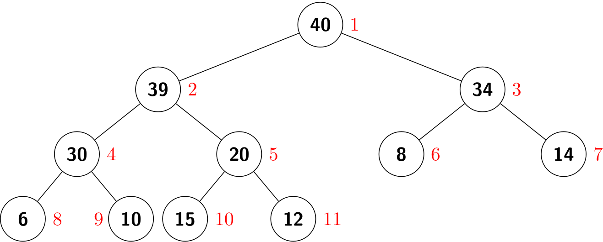

# PQ Implementation (1)
## API
Priority queues are characterized by the *remove the maximum* and *insert* operations. A typical `MaxPQ` supports the following APIs:

- `insert(v)`: insert a key into the priority queue
- `max()`: return the largest key
- `delMax()`: return and remove the largest key
- `isEmpty()`: is the priority queue empty?
- `size()`: number of keys in the priority queue

Any `MaxPQ` implementation is easily converted into a `MinPQ` implementation and vice versa.

## Elementary implementations
The simplest priority-queue implementation is based on the code for stacks.

- *insert*: The same for `push()` in the stack.
- *remove the maximum*: exchange the maximum item with the item at the end, and then delete that one, as we did with `pop()` for stacks.

Another approach is to add code for *insert* to keep the keys in the array in order. Thus, the largest element is always at the end.

| data structure | insert | remove maximum |
| ------ | ------ | -----
| ordered array | \\(O(N)\\) | \\(O(1)\\) |
| unordered array | \\(O(1)\\) | \\(O(N)\\)

In addition, if we start with the linked list the linked list representation, the performance analysis is the similar.

As we can see, an ordered sequence is the prototypical *eager* approach, where we do as much work we can up front to make the latter operations efficient; unordered sequence is the *lazy* approach, where we defer doing work until sequences. But, both methods are unable to support all operations that take *constant* time.

How can we achieve a balance so that all operations are efficient? In the following section, we will learn another important data structure called **heap** that makes it possible.

## Heap based implementation
### Heap
> A binary tree is *heap-ordered* if the key in each node is larger than or equal to the keys in that node's two children (if any).

From this definition, we can know that **the largest key in a heap-ordered binary tree is found at the root**. Different from a BST, duplicated keys are allowed in a heap-ordered binary tree.

#### Binary heap representation
We can use a linked representation for heap-ordered binary trees, as we did for a BST. But, it is particularly convenient to use a *complete* binary tree to represent it.

Complete binary tree provides the opportunity to use a compact array representation that does not involve explicit links. To be specific, we represent complete binary trees sequentially within an array by putting the nodes in *level order*, with the root at position 1, its children at positions 2 and 3, their children in positions 4, 5, 6 and 7, and so on.

| i | 0 | 1 | 2 | 3 | 4 | 5 | 6 | 7 | 8 | 9 | 10 | 11 |
| --- | --- | --- | --- | --- | ---- | ---- | --- | --- | --- | --- | --- | --- |
| a[i] | | 40 | 39 | 34 | 30 | 20 | 8 | 14 | 6 | 10 | 15 | 12 |

>A binary heap is a collection of keys arranged in a complete heap-ordered binary tree, represented in level order in an array (not using the first entry).

Using this representation, the relationship between *parent-children* in a binary heap can be inferred by the position (i.e, index) in an array. For brevity, we will use *heap* when referring to a binary heap.

- The parent of the node in position *k* is position \\(\lfloor k/2 \rfloor\\).
- The two children of the node in position *k* are in positions *2k* and *2k + 1*.

It is easy to prove that the height of a complete binary tree of size N is \\(\lfloor \lg{N} \rfloor\\). Due to this property, we can design algorithms in guaranteed logarithmic time.

| data structure | insert | remove maximum |
| ------ | ------ | -----
| binary heap | \\(O(\lg{N})\\) | \\(O(\lg{N})\\) 