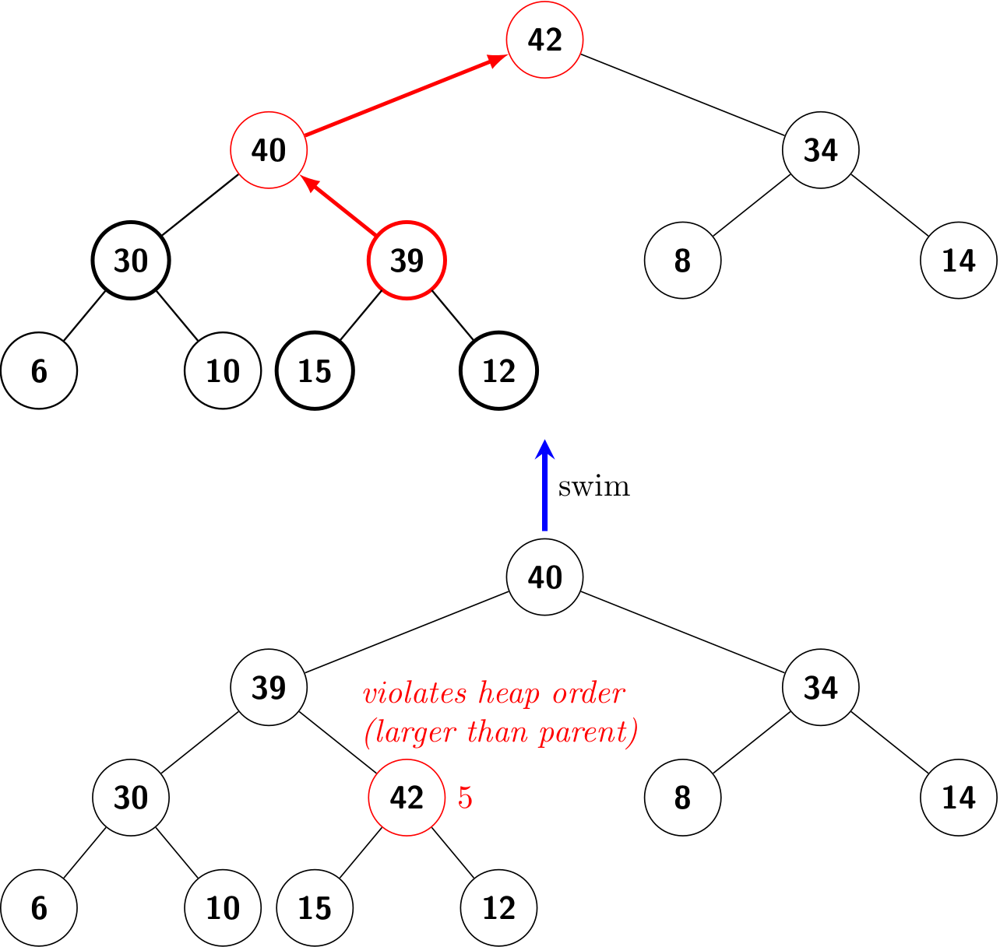
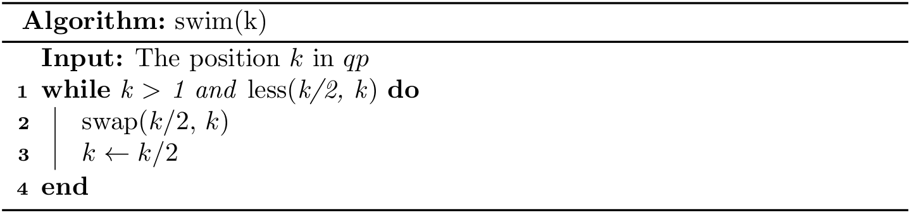
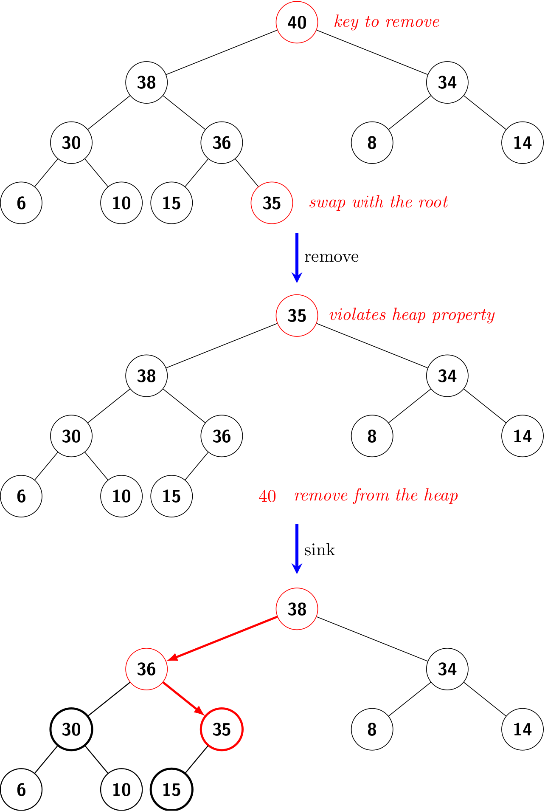

# PQ Implementation (2)
We represent a heap of size *N* in private array `pq[]` of length *N + 1*, with `pq[0]` unused. 

To make it easy to describe the algorithm and hide the differences in different languages, we further design two helper methods:

- `less(i, j)`: to test if `qp[i]` is less than `qp[j]`
- `swap(i, j)`: to swap (exchange) `qp[i]` and `qp[j]`

To compare two values, we can use [Comparable](https://docs.oracle.com/en/java/javase/11/docs/api/java.base/java/lang/Comparable.html)'s `compareTo()` method in Java, and the built-in `<` operator in Python. To swap two values,

```java
private void swap(int i, int j) {
    Key t = pq[i];
    qp[i] = qp[j];
    qp[j] = t;
}
```

```python
def _swap(self, i, j):
    self._pq[i], self._qp[j] = self._pq[j], self._qp[i] 
```

Like the modifications on a BST, heap operations could violate the *heap property*, and we need to fix it. We refer to this process as *reheapifying*, or *restoring*. 

There are two cases:

- For some node with a high priority, we have to travel *up* the heap.
- For some node with a low priority, we have to travel *down* the heap.

## Bottom-up reheapify (swim)
If the heap order is violated because a node's key becomes larger than its parent's key, then we can fix the violation by exchanging the node with its parent by swimming up.



To justify the method’s name, we think of the new node, having too large a key, as having to *swim* to a higher level in the heap.



## Top-down reheapify (sink)
If the heap order is violated because a node's key becomes *smaller* than one of both of that node's children's keys, then we can make progress toward fixing the violation by exchanging the node with the larger of its two children. This switch may cause a violation at the child; we fix that violation in the same way by moving down the heap.


To justify the method’s name, we think of the new node, having too small a key, as having to *sink* to a lower level in the heap.


## `insert()`
We add the new key at the end of the array, increment the size of the heap, and then swim up through the heap with that key to restore the heap property.

```java
public void insert(Key v) {
    pq[++N] = v;
    swim(N);
}
```


## `delMax()`
The exchange the last key with the root (whose key is the largest), decrement the size of the heap, and then sink down through the heap with that key to restore the heap property.

```java
public Key delMax() {
    Key max = pq[1];
    swap(1, N--);
    pq[N+1] = null;
    sink(1);
    return max;
}
```



## A few notes on implementations
The complete code can be found at [MaxPQ.java](https://github.com/ChenZhongPu/data-structure-swufe/blob/master/code/java/pq/src/main/java/org/swufe/datastructures/MaxPQ.java) and [max_pq.py](https://github.com/ChenZhongPu/data-structure-swufe/blob/master/code/python/pq/max_pq.py).

### Python
Since the first position (i.e., index 0) is unused, we can append `None` as a dummy at index 0.

```python
def __init__(self):
    self._pq = []
    self._pq.append(None)
```

And the size of the heap is `len(self._pq) - 1`.

### Java
If we use [ArrayList](https://docs.oracle.com/en/java/javase/11/docs/api/java.base/java/util/ArrayList.html) which has the resizing capability, the code is similar to the Python version. Instead, I choose the built-in array type and implement the resizing method by ourselves, as we did for stacks.

By the way, to swap two elements in an `ArrayList`, we can use:

```java
private void swap(int i, int j) {
    Collections.swap(pq, i, j);
}
```

## How to construct a heap from elements
Given a list of *N* elements, how to construct a heap from them? A naive way is to call the `insert()` method *N* times. Essentially, it is to call *N* times `swim()`, which takes \\(O(N\lg{N})\\) time totally.

```java
@SuppressWarnings("unchecked")
public MaxPQ(Key[] data) {
    n = data.length;
    pq = (Key[]) new Comparable[n + 1];
    System.arraycopy(data, 0, pq, 1, n);
    for (int k = 1; k <= n; k--) {
        swim(k);
    }
}
```

A clever method that is much more efficient is to use `sink()` to make sub-heaps as we go, which takes \\(O(N)\\) time in total.

```java
@SuppressWarnings("unchecked")
public MaxPQ(Key[] data) {
    n = data.length;
    pq = (Key[]) new Comparable[n + 1];
    System.arraycopy(data, 0, pq, 1, n);
    for (int k = n / 2; k >= 1; k--) {
        sink(k);
    }
}
```

In what follows, let's prove that sink-based heap construction uses at most *2N* compares and at most *N* exchanges. 

It suffices to prove that sink-based heap construction uses fewer than *N* exchanges because the number of compares is at most twice the number of exchanges. For simplicity, assume that the binary heap is perfect (i.e., a binary tree in which every level is completely filled) and has height *h*. 

A key at height *k* can be exchanged with at *k* keys beneath it when it is sunk down. Since there are \\(2^{h-k}\\) nodes at height *k*, the total number of exchanges is at most

\\[h + 2(h - 1) + 4(h - 2) + 8(h - 3) + \dots + 2^{h}(0) =
2^{h+1} - h - 2 = n - (h + 1) \leq n.
\\]