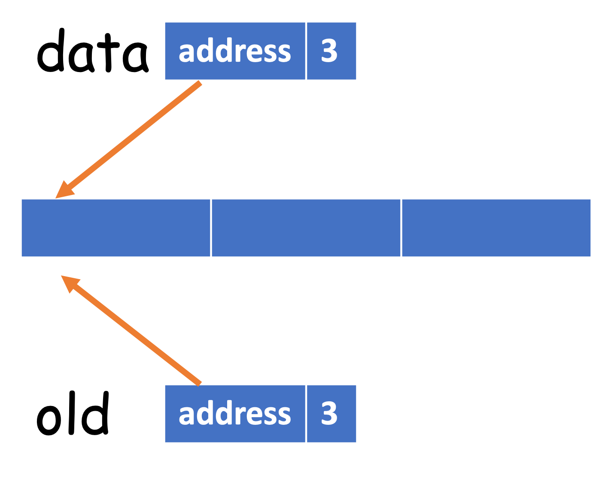
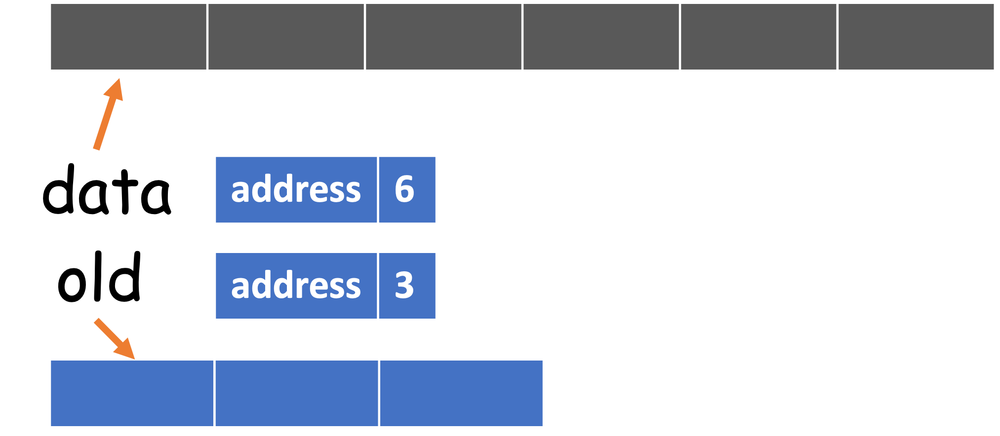

# Queues in Python
An implementation of our `Queue` API based on the `list` data structure is also straightforward.

```python
class Queue:
    """A first-in, first-out (FIFO) data structure."""

    def __init__(self):
        self._data = []

    def size(self):
        return len(self._data)

    def is_empty(self):
        return len(self._data) == 0

    def enqueue(self, item):
        self._data.append(item)

    def dequeue(self):
        if self.is_empty():
            raise NoElement('Dequeue from empty queue!')
        return self._data.pop(0)
```

Note that the `dequeue()` is based on `pop()` with index 0 as the parameter, meaning popping the first element from the list.

## Iterator
The iteration over a queue is like iterating a list, so we can reuse the iterator of the `list`:

```python
def __iter__(self):
    return iter(self._data)
```

We do not have to implement the `__next__` method manually. By taking leveraging of iterators, we can use the following `for` statement:

```python
q = Queue()
q.enqueue(1)
q.enqueue(9)
q.enqueue(4)
q.enqueue(9)
for i in q:
    print(i)
```

The complete code can be found at [queue.py](https://github.com/ChenZhongPu/data-structure-swufe/tree/master/code/python/stack-queue/queue.py).

## Time complexity
The following table summerizes the queue's time complexity:

| Operation | Running time |
| -------- |  ------- |
| enqueue() | \\(O(1)\\) |
| dequeue() | \\(O(N)\\) |
| is_empty() | \\(O(1)\\) |
| size() | \\(O(1)\\) |

As we can see, most operations, except for `dequeue()` are with constant time complexity[^time], so it is very efficient. However, the `dequeue()` is inefficient as it grows linearly with respect to the size of the queue (i.e., `N`).

To validate this theoretical analysis, I design a simple benchmark to test the performance (see `queue_vary_size()` method in [benchmark.py](https://github.com/ChenZhongPu/data-structure-swufe/tree/master/code/python/stack-queue/benchmark.py)). The main idea is summarized in the following:

- Initialize queues with different size (1000000, 2000000, 3000000, 4000000, 5000000).
- Perform the `dequeue()` operation, and time it[^random].


As we expect, the running time is roughly linear with respect to the size of the queue.

Now let's explore the reason of the inefficiency. Since the underlying data structure is a list, when we call `enqueue()` on it, the first item will be removed and **the next N-1 items will be shifted to the left**. Clearly, this moving action will result in \\(O(N)\\). Of course this design still achieves an acceptable performance in applications in which queues have relatively modest size, but when it comes to a large amount of data, it should be improved.

## Using an array circularly
This subsection is adapted from [Circular Queue](https://www.geeksforgeeks.org/circular-queue-set-1-introduction-array-implementation/). Such structure is also known as *ring buffer* in many applications.


As illustrated in the figure above, we shall maintain a *front* pointer (i.e., *index*) to point to the first item and use *rear* pointer (i.e., *index*) to point to next available position[^rear]. Assume this circular array is large enough to hold all items:

- `enqueue()`: update *rear* to next one in the clock-wise.
- `dequeue()`: update *front* to next one in the clock-wise.

Now let's consider a running example to understand the principle of circular arrays. Suppose the size of the array is 8, and the queue `q` is empty at start, and the `front` is 0:

| Operation |  Front |  Rear |  Size |
| ---- | ----- | ----- | ---- |
|  (Start) | 0 | 0 | 0 |
| q.enqueue(10) | 0 | 1 | 1 |
| q.enqueue(20) | 0 | 2 | 2 |
| q.enqueue(30) | 0 | 3 | 3 |
| q.dequeue() | 1 | 4 | 2 |
| q.enqueue(40) | 1 | 5 | 3 |
| q.enqueue(50) | 1 | 6 | 4 |
| q.dequeue() | 2 | 6 | 3 |

Obviously, the `dequeue()` operation only results in a pointer shift, so **the time complexity is \\(O(1)\\)**. What a clever design! In addition, we can find that the specific pointer (i.e., *index*) does not really matter, so we can maintain *front* and *size* instead, and the *rear* can be computed based on them.

```python
class CircularQueue:
    """A queue based on a circular array."""

    DEFAULT_CAPACITY = 10

    def __init__(self):
        self._data = [None] * CircularQueue.DEFAULT_CAPACITY
        self._size = 0
        self._front = 0
```

Then, what if we call `enqueue()` when *front* is 6 and *size* is 1? In this case, the implicit *rear* will become 0 because `(7 + 1) mod 8 = 0`. The `mod` operation makes the pointer in arrays be circular.

> It is only circular conceptually, and it is still a linear array. The implementation shares many ideas with *Stack based on array* in [Stacks in Java](./stack_java.md).

A final problem to be addressed is to resize. As we have learned in [Stacks in Java](./stack_java.md), we shall resize the underlying array if the size reaches to its capacity.

```python
def enqueue(self, item):
    # expand
    if self.size() == len(self._data):
        self._resize(2 * len(self._data))
    avail = (self._front + self.size()) % len(self._data)
    self._data[avail] = item
    self._size += 1
```

We always double the array's size when the size of a queue reaches to its capacity. `avail`, computed through a mod operation, means, in fact, `rear`, the available position in the array.

```python
def dequeue(self):
    if self.is_empty():
        raise NoElement('Dequeue from empty queue!')
    # shrink (optional)
    if self.size() <= len(self._data) // 4:
        self._resize(len(self._data) // 2)
    answer = self._data[self._front]
    self._data[self._front] = None
    self._front = (self._front + 1) % len(self._data)
    self._size -= 1
    return answer
```

The shrink operation is optional to save the memory space. Again, we update `front` through a mod operation. When the pointer shifts, it is a good practice to let it point to `None` for the sake of garbage collection.

The *resize* operation is a private method, and it is worthwhile to investigate how it works:

```python
def _resize(self, capacity):
    assert capacity > self.size()
    old = self._data
    self._data = [None] * capacity
    walk = self._front
    for i in range(self._size):
        self._data[i] = old[walk]
        walk = (1 + walk) % len(old)
    self._front = 0
```



To understand it, we shall have a basic knowledge about the object model in Python:

When we create a list `data`, we essentially create a list and assigns the reference to `data`. So `data` is not the list itself, and it roughly has two parts: the *address* pointing to the list, and the *size* of the list.

```python
data = [1, 2, 3]
old = data
```

If we add a new item to `old`, then `data` will also be updated:

```python
old.append(4)
# [1, 2, 3, 4]
print(data)
```

Therefore, `old` and `data` refer to the same object, but with different names[^memory]. Now let's revisit the implementation of `_resize()`. After `self._data = [None] * capacity` is called, it becomes



The next step is to copy from `old[front..rear]` to `data[0.._size]`. Of course, the range from `front` to `near` may be circular so it should be computed through the mod operation.

The complete code can be found at [circular_queue.py](https://github.com/ChenZhongPu/data-structure-swufe/tree/master/code/python/stack-queue/circular_queue.py). Please try to implement an iterator for circular queues on your own before checking the code in GitHub.

## A few notes on queues

> When you need queues, please consider [collections.deque](https://docs.python.org/3/library/collections.html#collections.deque), instead of implementing a new one from the scratch.

---
[^time] Like stacks, the time complexity of `enqueue()` is *amortized*.

[^random] To avoid the randomness brought by a single operation, we repeat it 20 times. Since 20 is much smaller than the size of queue, the measured time still makes sense.

[^rear] Some designs assume that `rear` points to the last item in a queue. In this case, `rear` is -1 when the queue is empty.

[^memory] https://towardsdatascience.com/python-memory-and-objects-e7bec4a2845