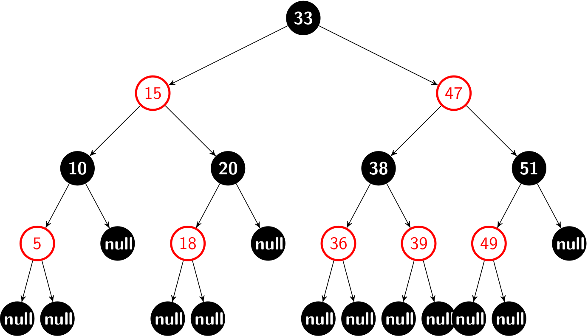
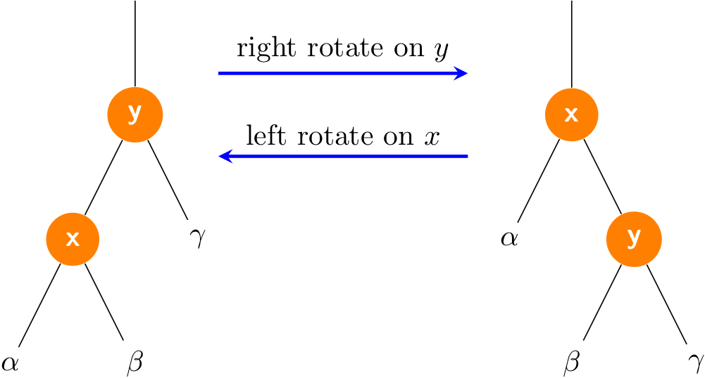
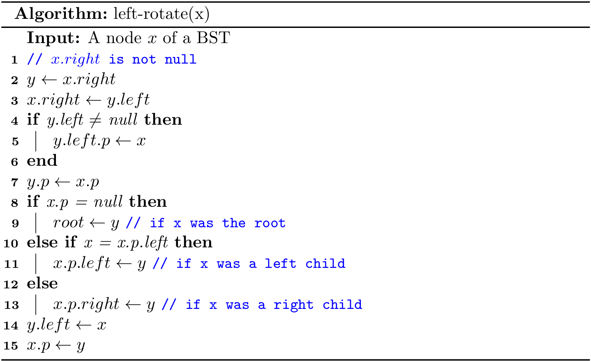
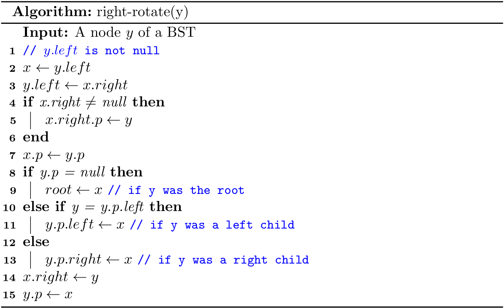

# Balanced Search Trees
The BST introduced in the previous sections work well for a wide variety of applications, but they have poor worst-case performance. We will further introduce a type of binary search tree where costs are *guaranteed* to be logarithmic, no matter what sequence of keys is used to construct them.

## The concept of *balanced*
A binary search tree is *perfectly height-balanced* if the left and right subtrees of any node are the same height. But maintaining perfect balance for dynamic insertions is too expensive and it is only possible if there are exactly \\(2^h-1\\) nodes. 

Therefore, in practice, if the height of a binary search tree is \\(O(lg{N})\\), then it is called **self-balancing**. Some specific balanced binary search trees have their own extra restrictions. For example, AVL tree requires that *the difference between heights of left subtree and the right subtree is not more than 1.* In this section, we mainly focus on the **red-black tree**, a well-known self-balancing binary search tree.

## Red-black trees
A *red-black tree* is a binary search tree with one extra bit of storage per node: its **color**, which can be either *RED* or *BLACK*. The height of a red-black tree with *N* keys is at most \\(2lg{N+1}\\), which is \\(O(lg{N})\\). The proof is given at the end of this section. So it is approximately *balanced*.

On the top of the regular node of a BST, we will start to introduce the parent reference `p` of a node in a red-black tree for the ease of implementation[^p]. We regard the `null`s as pointers to leaves, and the normal, key-bearing nodes as internal nodes of the tree.

A red-black tree is a binary search tree that satisfies the following **red-black properties**:

1. Every node is either red or black.
2. The root is black.
3. Every leaf (`null`) is black.
4. If a node is red, then both its children are black.
5. For each node, all simple paths from the node to descendant leaves contain the same number of black nodes. 



We call the number of black nodes on any simple path from, but not including, a node *x* down to a leaf the **black-height** of the node, denoted bh(*x*). By property 5, the notion of black-height is well defined, since all descending simple paths from the node have the same number of black nodes. The black-height of a red-black tree is the black-height of its root. Take the red-black tree for instance, the *black-height* is 2.

### A few notes on leaves
The leaf (`null`) here serves as a *sentinel* (recall the design of the doubly linked list). The sentinel makes it possible to treat a `null` child of a node *x* as an ordinary node whose parent is *x*, and this design leads to simpler code (especially for the deleting algorithm).

Given a node `x`, we cannot always get its *color*, *left*, *right* or *parent* by the dot syntax safely due to the *NullPointerException*. What is more, the color of a leaf (i.e., `null`) should be *BLACK* in our settings. So we can design a set of helper methods, such as:

```java
private boolean colorOf(Node<Key> x) {
    return x == null ? BLACK : x.color;
}

private Node<Key> parentOf(Node<Key> x) {
    return x == null ? null : x.p;
}
```

Some books (e.g., *Introduction to Algorithms*) design a better solution to `null` problem for the sake of space efficiency:

```java
Node<Key> NIL = new Node(null, BLACK, null, null, null);
```

Then, we can use only one `NIL` object in a red black tree throughout the code. For example, the `root` itself is initialized to `NIL` object instead of `null`. In addition, it is always safe to access(assign) *color*, *left*, *right*, and *parent* for(to) all nodes. We will use this technique for the deleting algorithm.

When it comes to illustration, we often omit all leaves as well as the parent of `root` by giving a clean figure:


### A few notes on color
In Java, the color of the node can be represented by either boolean or `enum` values.

```java
enum Color {
    RED, 
    BLACK
}
```

However, Python does not provide built-in supports for `enum`. For the consistency of implementations, the data type of color is set to boolean:

```java
private static final boolean RED   = false;
private static final boolean BLACK = true;
```

### A red-black tree is balanced

The following lemma shows why red-black trees make good search trees.

> A red-black tree with *N* internal nodes has height at most \\(2lg{N+1}\\).

First, we can prove by induction that the subtree rooted at *x* contains at least \\(2^{bh(x)}-1\\) internal nodes. Let *h* be the height of the tree. According to property 4, at least half the nodes on any simple path from the root to a leaf, not including the root, must be black. Consequently, the black-height of the root must be at least *h/2*, and thus,

\\[N \geq 2^{h/2} -1 \\]

Moving the 1 to the left-hand side and taking logarithms on both sides yields

\\[h \leq 2\lg{N+1}\\]


The lemma above shows that common operations (search, insertion, finding the minimum, finding the maximum, floor, ceiling, rank, select, delete the minimum, delete the maximum, delete) **take logarithmic time \\(O(lg{N})\\) in the worst case**.

## Rotations
All searching related algorithms in a red-black tree are the same with those for a regular BST. But as for insertion and deleting, the modified tree may violate the red-black properties. To restore these properties, we need to re-balance the tree. The key point of re-balancing is **rotations** by updating the pointers.

Rotation is a local operation in a search tree that preserves the **binary-search-tree property**. It has two kinds of rotations: left rotations and right rotations.



Let me emphasize the fact again that that a rotation operation preserves the binary-search tree property: the keys in \\(\alpha\\) precede *x.key*, which precedes the keys in \\(\beta\\), which precede *y.key*, which precedes the keys in \\(\gamma\\).

### Left rotations



### Right rotations



Both rotations operations run in \\(O(1)\\) time.

---
[^p] The parent reference is optional, but it will facilitate our implementation when the up-swimming is required.