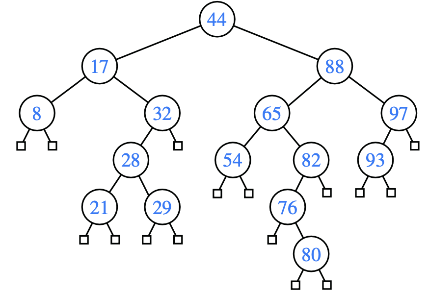

# Binary Search Trees
A tree without any restriction is unpractical in general, and in this section, we introduce a simple restriction that each node has exactly two links, which are called its **left** and **right** links, that point to nodes called its *left child* and *right child*, respectively.


Such data structure is known as **binary tree**, and we can define it as a either a null link or a node with a left link and a right link, each references to (disjoint) subtrees that are themselves binary trees. 

In a **binary search tree**, each node also has a key (and a value)[^value], with an ordering restriction to support efficient search.

> A binary search tree (**BST**) is a binary tree where each node has a (*comparable*) key and satisfies the restriction that the key in any node is larger than the keys in all nodes in that node’s left subtree and smaller than the keys in all nodes in that node’s right subtree.



The reason why the ordering restriction matters is that it can reduce the time of searching greatly. For example, given a binary search tree with integer keys, how to search 65? Let's start from its root:

- Since 65 > 44, go to its right child.
- Since 65 < 88, go to its left child.
- Since 65 == 65, bingo!

Only three comparisons are required while searching, and this idea is also found at the binary search of a sorted list (recall [BinarySearch.java](https://github.com/ChenZhongPu/data-structure-swufe/tree/master/code/java/unit-work/src/main/java/org/swufe/datastructure/BinarySearch.java) or [binary_search.py](https://github.com/ChenZhongPu/data-structure-swufe/tree/master/code/python/start/binary_search.py)).

Let's recap the *binary-search-tree property* again: Let *x* be a node in a binary search tree.

- If *y* is a node in the left subtree of *x*, then \\(y.key \leq x.key \\).
- If *y* is a node in the right subtree of *x*, then \\(y.key \geq x.key \\).

For simplicity, we assume all keys are unique in our implementation. In other words, duplicated key are not allowed.

## BST structure
Now let's talk about how to design a BST. Like a linked list, a BST can be represented by its *root* node due to the fact that it is recursive, where a node[^parent] consists of

- a link to its left subtree
- a link to its right subtree
- the key
- (the value)

And it can be roughly described using the following Python code:

```python
class Node:
    def __init__(self, key, left=None, right=None):
        self.key = key
        self.left = left
        self.right = right

class BST:
    def __init__(self):
        self.root = None
```

### A few notes on *comparable*
In a BST, the keys should be *comparable*. The basic data types, such as `int`, `double`, and `String` are comparable. Then what about a `Dog` class?  Can we say a dog is larger or smaller than another dog? Such comparison makes sense if and only if a `Dog` is comparable.

In Java, it is enforced by the [Comparable](https://docs.oracle.com/en/java/javase/11/docs/api/java.base/java/lang/Comparable.html) interface, and it can also combined with generics. In addition, we can use its `compareTo()` method, instead of the comparison operators (e.g., >, <, ==) in the code.

```java
class Node<Key extends Comparable<Key>> {
    ...
}
```

In Python, in order to use the comparison operator (e.g., >, <, ==) directly, one shall provide the rich comparison methods for ordering in the user-defined class[^comparison]. Luckily, it is the responsibility for people who use a BST, not for us who create a BST.

## BST implementation

### `size()`
We can also maintain the `size` member variable in a BST like we did in linked lists. Here we adopt another solution: `Node` holds an instance variable `n` which givens the node count in the subtree rooted at the node.

```python
class Node:
    def __init__(self, key, n=1, left=None, right=None):
        self.key = key
        self.n = n
        self.left = left
        self.right = right
```

And our implementations will benefit a lot from such recursive design. However, as for traditional iterative implementations, we assume that `Node` does not hold `n`; Instead, the BST ADT maintains `size`.


Then the size of a BST is `size(root)`; it runs with a constant time complexity.

### `put()`
This method is often called `insert()` in some implementations, and it is used to add a new key to a BST.
#### Iterative `put()`
**A new key will always be put as a leaf**. Like the algorithms in linked list, we shall maintain a pointer as the *parent* while descending the tree.


The following figure shows inserting a node with key 13 into a binary search tree. The simple path from the root down to the position where the node is inserted is shown in blue. The new node and the link to its parent are highlighted in orange.


As we can see, to insert a new key, we shall descend from the root to a leaf. Suppose *h* is the height of the tree, the time complexity of `put()` is \\(O(h)\\).

#### Recursive `put()`
To make use of recursions, we first design an algorithm to insert a `key` to the tree rooted at `x`. Since updating could modify the tree, we shall return the new *root* as the result.


Then to put a key onto a BST can be written as

```java
root = put(root, key);
```

It is worthwhile to take the time to understand the dynamics of this recursive implementation. Again, the iterative version is more efficient while the recursive one is easier to write.

### `get()`
This method is often called `search()` in some implementations, and it is used to get the node containing the given *key*; `null` will be returned if the *key* is not found.

#### Iterative `get()`
It is, in fact, a binary search tree for a BST. It begins its search at the root and traces a simple path downward in the tree.


Like `put()`, the running time of `get()` is also \\(O(h)\\).

#### Recursive `get()`
We can also implement it with a plain *tail-recursion*.


Then to get a node from a BST given a `key`, we can use 

```java
return get(root, key);
```

---
[^value] For simplicity, the associated value is not discussed in this chapter.

[^parent] Some implementations would also maintain an extra link to its parent.

[^comparison] See more at https://stackoverflow.com/questions/8276983/.
