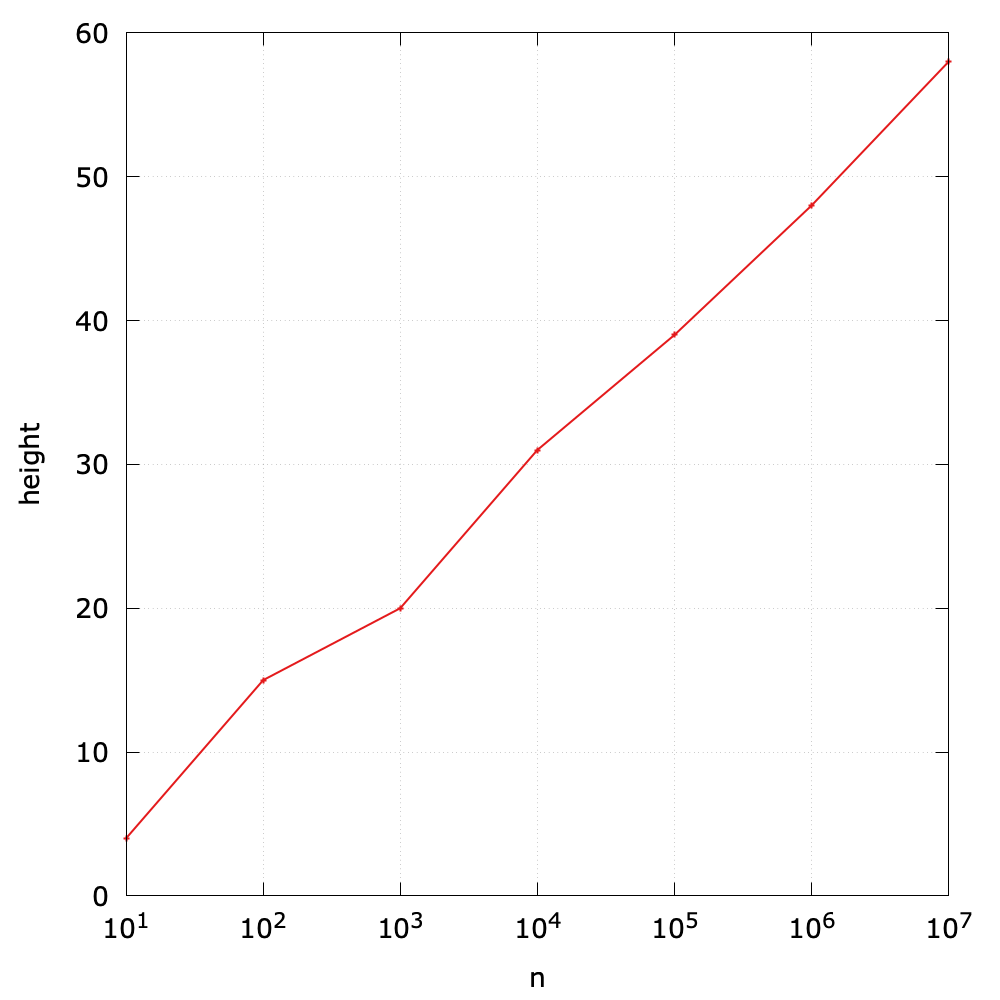

# Binary Search Trees (2)
According to the definition of a BST, it is *ordered* in terms of a *set* of keys. 

If we project the keys in a BST such that all keys in each node's left subtree appear to the left of the key in the node and all keys in each node's right subtree appear to the right of the key in the node, then we always get the keys in sorted order. Therefore, it is possible to define the *predecessor* and *successor* of a node in a BST.

                8
            /      \
           3       10
         /   \       \
        1     6      14
             /      /   \
            4      12   18


## Order-based operations
In the last section, we have showed how to implement some order-based operations, such as `min()` and `max()`. In fact, the implementation of `remove()` also relies on the *successor* of a node.

In what follows, we consider more order-based operations.

- **Floor and ceiling**: As for `floor()`, it returns the largest key which is not greater than the given key, while `ceiling()` returns the smallest key which is not less than the given key. For example, `floor(5)` is 4, `ceiling(13)` is 14, but `floor(0)` return `null` because there is no key equal or less than 0.


Interchanging right and left (and less and greater) gives `ceiling()`.

- **Select**. It returns the key of a given rank. The smallest key is with rank 0, while the largest one is with rank (size - 1). For example, `select(3)` returns 6, and `select(9)` returns null.


- **Rank**. It is the inverse method of `select()`, and returns the rank given a key. For example, `rank(6)` is 3.


## Tree walk
Given a tree, how can we traverse nodes? In this subsection, we will introduce three tree traversal algorithms.

- **Inorder tree walk**. It visits the key of the root between the values in the left subtree and those in its right subtree. As for the BST above, it will traverse the keys in an ascending order (1 -> 3 -> 4 -> 6 -> 8 -> 10 -> 12 -> 14 -> 18).

The following is to print all keys in a BST using *inorder tree walk*:


- **preorder tree walk**. It visits the root before the nodes in either subtree. As for the BST above, it will print 8 -> 3 -> 1 -> 6 -> 4 -> 10 -> 14 -> 12 -> 18.
- **postorder tree walk**. It visits the root after the nodes in its subtrees. As for the BST above, it will print 1 -> 4 -> 6 -> 3 -> 8 -> 12 -> 18 -> 14 -> 10.

## Performance Analysis

> In a BST, all operations take time proportional to the height of the tree, in the worst case.

As for *N* random keys, the height[^cost] of a BST is about \\(\lg{N}\\). The following Java code is used to compute the height of node `x` in a BST:

```java
private int height(Node<Key> x) {
    if (x == null) return -1;
    else return 1 + Math.max(height(x.left), height(x.right));
}

public int height() {
    return height(root);
}
```

Here is a simple experiments to show the relationship between the height and the size of a BST. The size ranges from \\(10^1\\) to \\(10^7\\):



However, in the worst case, a BST can be degraded into an ordered linked list if one inserts ordered keys sequentially. In this case, the height will be *N*.

As for the search operation, we can summarize the time complexities:

| Algorithm (DAT) | Worst case cost | Average case cost |
| ------ | ------ | ----- |
| sequential search (unordered linked list) | \\(O(N)\\) | \\(O(N)\\) | 
| binary search (ordered array) | \\(O(lg{N})\\) | \\(O(lg{N})\\) |
| binary tree search (BST) | \\(O(N)\\) | \\(O(lg{N})\\) |

Therefore, this motivates us to seek better algorithms and data structures, which we consider next.

---
[^cost] The theoretical cost is \\(1.39\lg{N}\\).