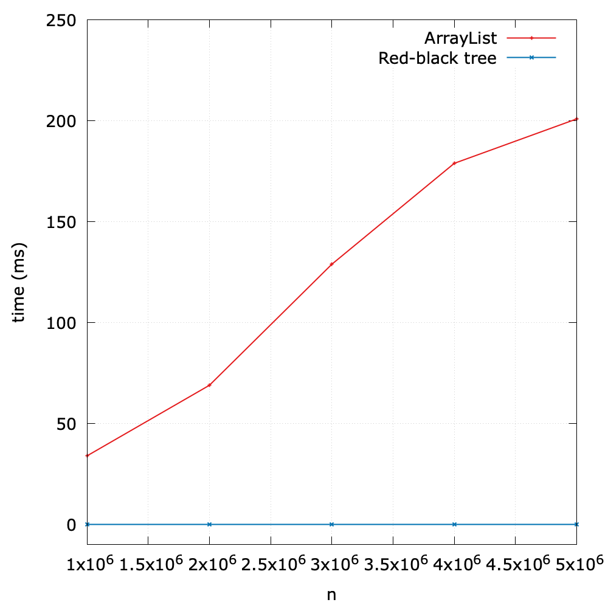

# Case Study
As for the search/insert operation, we can summarize the time complexities of four common data structures we have learned:

| Algorithm (DAT) | Worst case cost   *after N inserts* | Average case cost   *after N random inserts* |
| ------ | ------ | ----- |
| sequential search (unordered linked list) | **search**: \\(O(N)\\)   **insert**: \\(O(N)\\) | **search**: \\(O(N)\\)   **insert**: \\(O(N)\\) | 
| binary search (ordered array) | **search**: \\(O(lg{N})\\)   **insert**: \\(O(N)\\) |  **search**: \\(O(lg{N})\\)   **insert**: \\(O(N)\\) |
| binary tree search (BST) | **search**: \\(O(N)\\)   **insert**: \\(O(N)\\) | **search**: \\(O(lg{N})\\)   **insert**: \\(O(lg{N})\\) |
| red-black BST | **search**: \\(O(lg{N})\\)   **insert**: \\(O(lg{N})\\)  | **search**: \\(O(lg{N})\\)   **insert**: \\(O(lg{N})\\)  | 

## Time efficiency
As we can see, the RBT is very efficient in terms of common operations, so it can be used fundamental building blocks in data structures underlying numerous applications:

- Many language standard collections, such as [HashMap](https://docs.oracle.com/en/java/javase/11/docs/api/java.base/java/util/HashMap.html) in Java and most implementations of STL in C++, are based on the red-black trees.
- Linux kernel uses the red-black tree in the memory management and task scheduling.

In what follows, we designed an experiment to compare [ArrayList](https://docs.oracle.com/en/java/javase/11/docs/api/java.base/java/util/ArrayList.html) and a red black tree in terms of their search efficiency.

The results show the great superiority of the red-black tree.