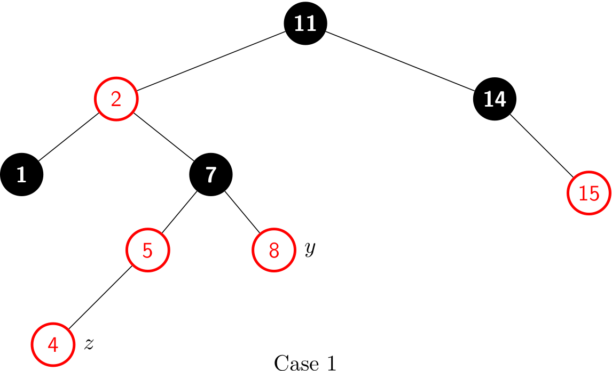
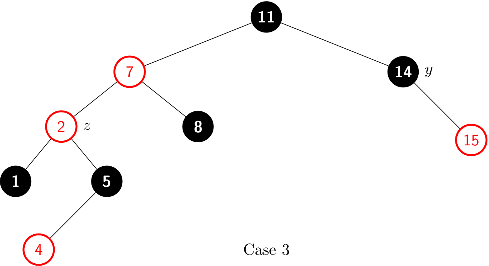
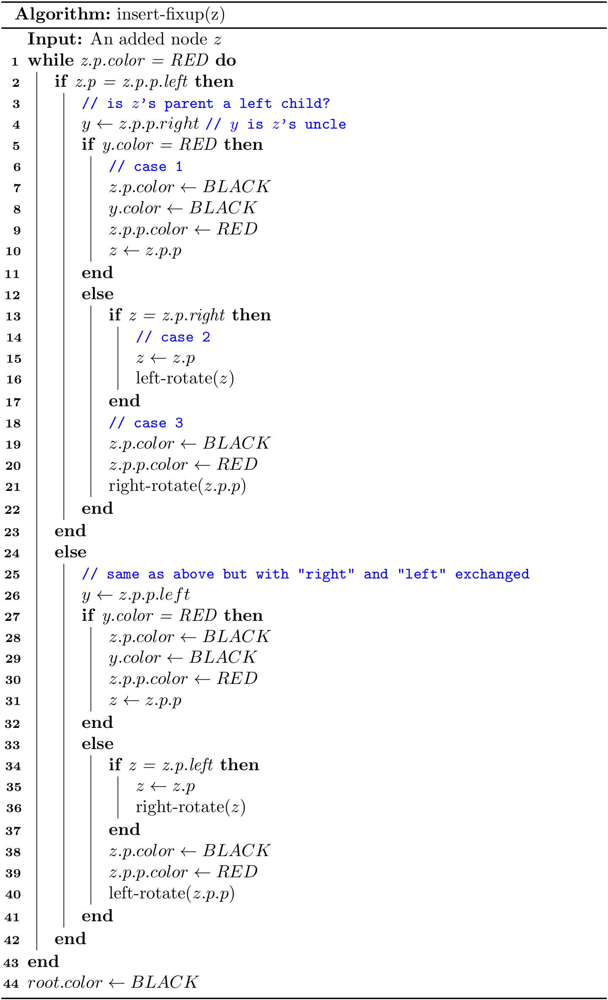
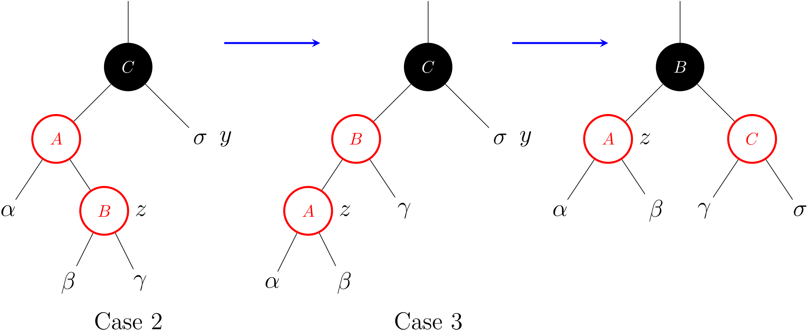

# Red Black Trees (1)
From now on, I will refer to a red black tree as a RBT. The complete code can be found at [RBT2.java](https://github.com/ChenZhongPu/data-structure-swufe/blob/master/code/java/tree/src/main/java/org/swufe/RBT2.java) and [rbt.py](https://github.com/ChenZhongPu/data-structure-swufe/blob/master/code/python/tree/rbt.py).

## `put()`
Adding a new key to a RBT is generally the same with the algorithms for a regular BST. But a fix-up step `insert-fixup()` is required because modifying would violate the *red-black tree properties*.


For a newly created node, its color is *RED* by default.

```java
public Node(Key key) {
    this.key = key;
    color = RED;
    left = null;
    right = null;
    p = null;
}
```

To understand how `insert-fixup()` works, we shall first determine which violations of the red-black properties might arise upon inserting node `z` and coloring it red.

## `insert-fixup()`
What violations of the red-black properties might occur?

- **Case a**: If `z` is the `root`, then it violates Property 2. The solution to this is naive: just re-color it to *BLACK*.
- **Case b**: If `z` is not the `root`, and its parent is also colored in *RED*, then it violates Property 4. The solution to this is a bit complicated.

In describing the structure of a RBT, we’ll often need to refer to the sibling of a node’s parent. We use the term **uncle** for such a node. The following figures show `insert-up()` operates on a sample RBT, with cases depending in part on the colors of a node, its parent, and its uncle.



Case 1 violates Property 4 after a node `z` is inserted. After re-coloring, it becomes:


Case 2 also violates Property 4. After a left rotation, it becomes:



Case 3 also violates Property 4. After a right rotation, it becomes a legal RBT:


The three cases above show the operations when `z`'s parent is a left child. And if `z`'s parent is a right child, there are another three cases with "right" and "left" exchanged.



We can use the helper methods to access the *parent*, *left*, *right* and *color* of a node `x`. For example, `z.p.p.left` can be written as `leftOf(parentOf(parentOf(z)))`. However, it is safe to use `z.p.p.left` directly. Because if `z.p.color` is *RED*, then `z`'s grandfather (i.e., `z.p.p`) always exists.

By the way, it does not make sense to assign a color to `null`, so we can use the following helper method to set the color for a given node:

```java
private void setColor(Node<Key> x, boolean c) {
    if (x != null) {
        x.color = c;
    }
}
```

## Maintenance
There are six cases within the **while** loop, but we'll examine only the tree cases in lines 2-23, when *z*'s parent *z.p* is a left child of *z*'s grandparent *z.p.p*. The proof for lines 21-41 is symmetric.

Case 1 differs from cases 2 and 3 by the color of *z*'s uncle *y*. If *y* is red, then case 1 executes. Otherwise, control passes to cases 2 and 3. In all three cases, *z*'s grandparent *z.p.p* is black, since its parent *z.p* is red, and Property 4 violated only between *z* and *z.p*.

### Case 1: `z`'s uncle `y` is red


The figure above shows the situation for case 1, which occurs when *z*, *z.p* and *y* are red. In fact, the same action occurs regardless of whether *z* is a right child or *z* is a left child.

**Because *z*'s grandparent *z.p.p* is black, its blackness can transfer down one level to both *z.p* and *y*,** thereby maintaining Property 5. Then, the pointer *z* moves up two levels in the tree.

### Case 2: `z`'s uncle `y` is black and `z` is a right child 

### Case 3: `z`'s uncle `y` is black and `z` is a left child



As we can see, a *left rotation* immediately transforms case 2 into case 3. Case 3 performs some color changes and a right rotation. At this point, there are no longer two red nodes in a row.
