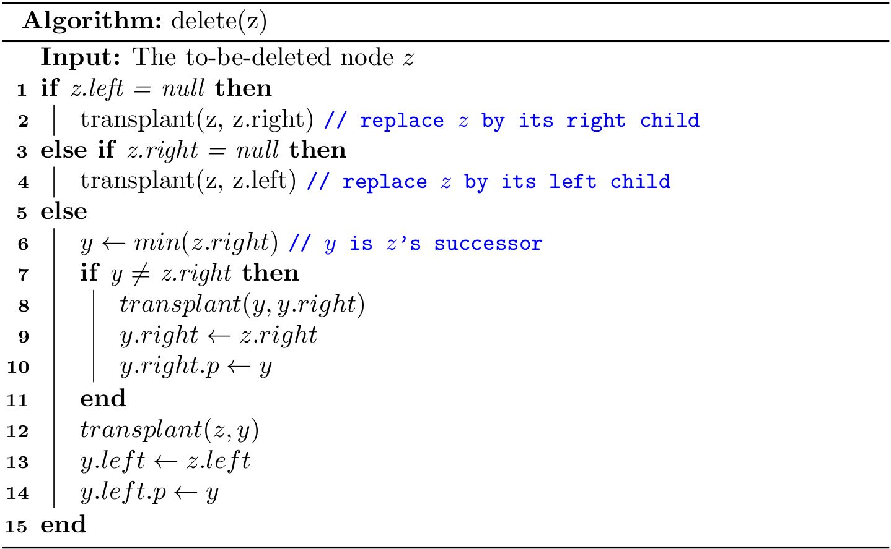
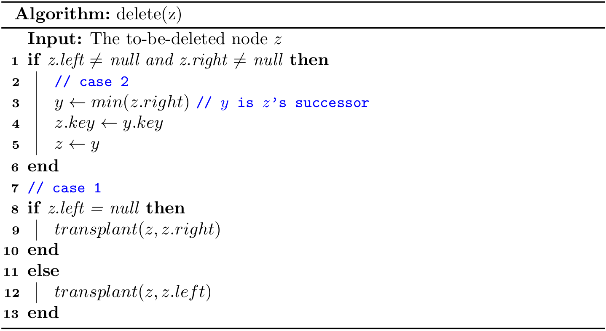
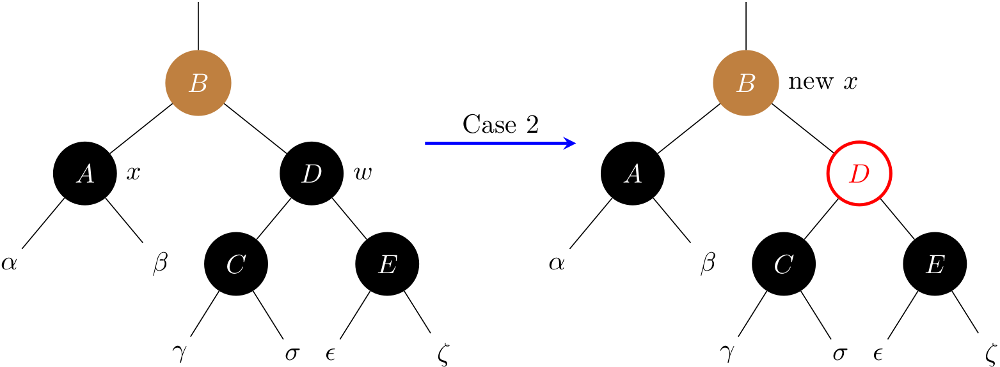

# Red Black Trees (2)
In this section, we will focus on the deletion. Deleting a node from a RBT takes \\(O(\lg{N})\\) time, and it is more complicated than inserting a node.

## Delete a node (1)

### A helper method
As part of the process of deleting a node, subtrees need to move around. The following subroutine `transplant()` does the following work:
- replaces the subtree rooted at node `u` with the subtree rooted at node `v`
- node `u`'s parent becomes node `v`'s parent
- `u`'s parent ends up having `v` as its child


First, let's design an algorithm to delete a node as if there were no color in nodes.



Deleting a node given a `key` can be described as

- First, find a node `z` given a `key`
- Then, delete node `z`

```java
public void remove(int key) {
    Node z = get(key);
    if (z != null) {
        delete(z);
    }
}
```

## Delete a node (2)
Recap the two cases of deleting a node `z` in a BST:

- **Case 1**. `z` has at most one child. To delete `z`, we use its child (it can be `null`) to take the position of `z`.
- **Case 2**. `z` has two children. Then `y` is the successor of `z.right`. If `y` is not `z.right`, execute step (a) and (b) sequentially; otherwise, execute only step (b).
    - (a) `y.right` (it can be `null`) takes the position of `y`, and then update `y.right` to `z.right`.
    - (b) `y` takes the position of `z`, and then update `y.left` to `z.left`.

In fact, case 2 can be transformed into case 1 by updating the `z.key` to `y.key`. In light of this, we can design a more readable algorithm:



By taking the leverage of the ternary conditional operator in Java, the code can be even shorter in practice for case 1:

```java
Node<Key> x = (z.left != null) ? z.left : z.right;
transplant(z, x);
```

In Python, it can be written as:

```python
x = z.left if z.left is not None else z.right
transplant(z, x)
```

## Delete a node (3)
To delete a node `z` in a RBT, we need to consider the color of it:

- If `z` is *RED*, then it will not violate any *red-black tree property*.
- If `z` is *BLACK*, then it violates Property 5 (*change in black height).

We are going to say that Property 5 has not been violated and the node `x` which is now occupying `z`'s original position has an *extra black* in it. In this way, the property of black height is not violated but Property 1 is violated, because `x` now is either

- Double black, transformed from *BLACK*.
- Red and black, transformed from *RED*.

For example, deleting `z` in the following result in a *red and black* node:


With this thinking, we can say that either Property 1, 2 or 4 can be violated. If `x` is *red and black* or is `root`, we can simply color it black.

> ### What if `x` is null?
> Now let's consider a special case when `x` is null (i.e., `z` does not have any child). As we can see, the introduction of the sentinel (`NIL`) will lead to simpler code, because we can regard it as a regular node whose color is always black. For example, we are able to up-swim to the parent from a `NIL`, and \\(v.p \gets u.p\\) is always valid in the `transplant`.

Therefore, suppose `z` has at most one child, we use its child `x` to replace its position:

- **Case a**: if `z` is red, then just delete it.
- **Case b**: if `z` is black with a red child `x`, then color `x` to black.
- **Case c**: if `z` is black, and `x` is also black, then things get complicated, and we need to fix it up. In this case, `x` is a *double black* node.

To understand case c, readers can try to maintain the BST by deleting 1:


In what follows, we will analyze four sub-cases for *case c* when `x` is a left child, and another four cases when `x` is a right child is symmetric.


### Case 1: `x`'s sibling `w` is red


Case 1 is transformed into case 2, 3, or 4 by exchanging the colors of nodes *B* and *D* and performing a left rotation.

### Case 2: `x`'s sibling `w` is black, and both of `w`'s children are black



To balance the black height, this cases removes one black from both *x* and *w*, leaving *x* with only one black and leaving *w* red. To compensate for *x* and *w* each losing one black, `x.p` can take on an extra black. Line 16 does so by moving up `x` to its parent.

**Note that *B* is colored in brown, meaning it can be either black or red**. If case 2 enters from case 1, then the new node *x* (i.e., *B*) is red-and-black. Then the **while** loop terminates.

### Case 3: `x`’s sibling `w` is black, `w`’s left child is red, and `w`’s right child is black


This case switches the colors of *w* and its left child *w.left*, and then performs a right rotation on *w*. Then it falls through into case 4.

### Case 4: `x`'s sibling `w` is black, and `w`'s right child is red.


Some color changes and a left rotation on *x.p* allow the extra black on *x* to vanish. Note that *D*'s color is set to the one of *B*. Line 31 sets *x* to `root`, and the **while** loop will terminate.