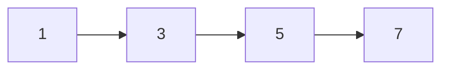
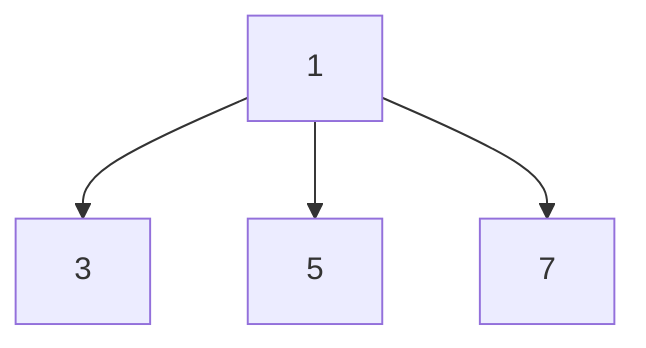
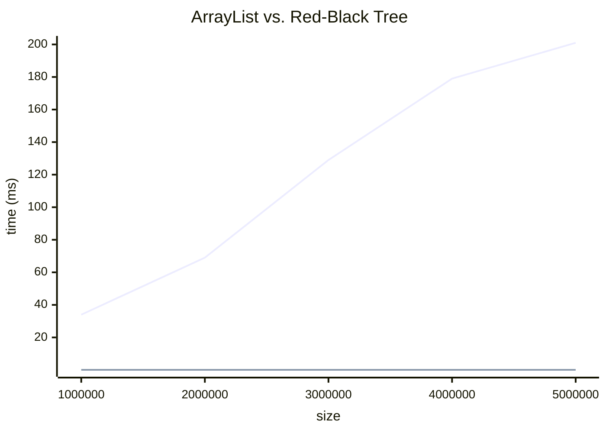
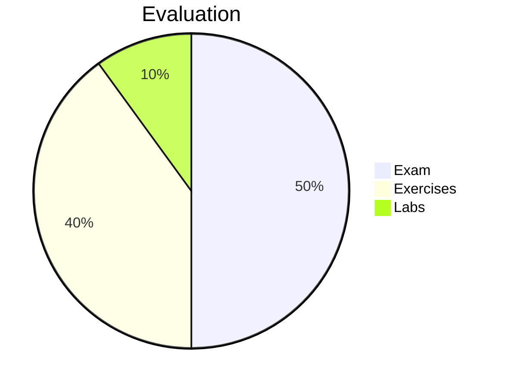

# Data Structures

## Lecture 0: Introduction

CHEN Zhongpu, Fall 2024

<div class="text-10px">
School of Computing and Artificial Intelligence, SWUFE
</div>
<div class="flex justify-center items-center h-60px mt-8px">
    
</div>

---

# About Me

- <flat-color-icons-businessman />
  CHEN Zhongpu 陈中普; zpchen@swufe.edu.cn
- <flat-color-icons-department /> Gezhi Building 格致楼, Room 310
- <flat-color-icons-serial-tasks /> Database Systems, AI-driven Data Management
- <flat-color-icons-home /> https://zhongpu.info

<br/>

<v-click>

# About This Course

According to Wikipedia [<flat-color-icons-wikipedia />](https://en.wikipedia.org/wiki/Data_structure):

> In computer science, a data structure is a <span class="text-red">data organization</span>, and storage format that is usually chosen for <span class="text-red">efficient</span> access to data.

</v-click>

<v-click>

<div class="flex">
    
    
</div>

</v-click>

---

# Data Structures

We'll learn how to organize data in a way that makes it easy to access and manipulate.

<div class="flex">
  <div>

  </div>
  <div>

  </div>
</div>

## Example (1)

Imagine you are building a system to manage a library's book inventory, and you need to check if a book is available.

<div class="flex">
<div>
```python
books = [
    {"title": "Book A", "author": "Author 1"},
    {"title": "Book B", "author": "Author 2"},
    # ... thousands more books
]
```
</div>
  <div>
```python
def is_book_available(title):
    for book in books:
        if book["title"] == title:
            return True
    return False
```
  </div>
</div>

---

# Example (1)

We'll learn how to organize data in a way that makes it easy to access and manipulate.

## A More Efficient Way <flat-color-icons-combo-chart />

<div class="flex space-x-10">
  <div>

```python
books = {
    "Book A": {"author": "Author 1"},
    "Book B": {"author": "Author 2"},
    # ... thousands more books
}

def is_book_available(title):
    return title in books
```

  </div>
  <div>

`Efficiency is All You Need!`



  </div>
</div>

---

# Example (2)

You need to know what's going on behind the scenes to make the right choice.

```python
number = [i for i in range(1000000)]
# how to add a new number?
numers.append(42)
number.insert(0, 42)
```

<br/>

<v-click>

<div class="grid grid-cols-12">
  

  <div class="col-span-9">

> <span class="text-red">Bad programmers worry about the code. Good programmers worry about data structures and their relationships.</span> By Linus Torvalds, creator of `Linux` <flat-color-icons-linux />

  </div>
</div>

<div class="grid grid-cols-12">


<div class="col-span-9">

> <span class="text-red">Data structures, not algorithms, are central to programming.</span> By Rob Pike, inventor of `Go` <logos-gopher />

</div>
</div>

</v-click>

---

# Algorithm

For example, say `List` is a data structure which stores a list of elements, and supports `indexOf(v)` operation. And those operations can be described using [algorithms](https://en.wikipedia.org/wiki/Algorithm).

$$
Algorithm + Data\ Structures = Program
$$

We're going to focus on <span class="text-red">data structures</span>, as well as some basic skills about <span class="text-red">algorithm designs</span> and <span class="text-red">algorithm analysis </span>.

<v-click>

## How to Describe Algorithms? <arcticons-easy-coder class="text-blue" />

- Plain English
- Flow chart
- Source code (C, C++, Java, Python, ...)
- Pseudo code

<p v-after class="absolute bottom-8 left-70 text-red">/suː.doʊ/ not genuine;<br/> superficially appears to be one thing, but is something else.</p>

</v-click>

---

# Pseudo Code

<Latex>
<pre class="pseudocode">
\begin{algorithm}
  \caption{indexOf(arr, target)}
  \begin{algorithmic}
\FOR{$i = 0$ to $arr.size - 1$}
      \IF{$arr[i] == target$}
        \RETURN $i$
      \ENDIF
\ENDFOR
\RETURN $-1$
  \end{algorithmic}
\end{algorithm}
</pre>
</Latex>

Note that there is no standard for pseudo code, so you can use any format you like (`algorithmic` and `algorithm2e` in [Latex](https://www.overleaf.com/learn/latex/Algorithms) <arcticons-detexify class="text-red-400" /> are recommended).

---

# Data Structures are Everywhere

| Domain                  | Example                                               | Data Structure                         |
| ----------------------- | ----------------------------------------------------- | -------------------------------------- |
| Database                | MySQL <logos-mysql />                                 | B-Tree, Hash Table                     |
| Blockchain              | Bitcoin <logos-bitcoin />                             | Merkle Tree, Hash, Linked List         |
| Social Network          | Facebook <logos-facebook />                           | Graph                                  |
| Operating System        | Linux kernel <logos-linux-tux />                      | Linked List, Stack                     |
| Artificial Intelligence | LLM <arcticons-openai-chatgpt class="text-red-400" /> | List, Queue, Stack, Hash Table, Tensor |

---

# What We Will Learn

<div class="grid grid-cols-12">
<div class="col-span-6">

## Key Topics <flat-color-icons-todo-list />

- Python built-in data structures
- Algorithm analysis
- List
- Stack, Queue
- Tree
- Hash Table
- Graph

</div>
<div class="col-span-6">

## Pre-requisites and Tools <flat-color-icons-support />

- Object-oriented programming in Python 3.8+ <logos-python />
- IDE: PyCharm <logos-pycharm />, VSCode <logos-visual-studio-code />, Jupyter Notebook <logos-jupyter />
- Google <logos-google-icon />, ChatGPT <arcticons-openai-chatgpt class="text-red-400" />, [Claude](https://claude.ai/), Github Copilot <logos-github-octocat />, [Codeium](https://codeium.com/)

</div>
</div>

---

# Books and Resources

## Books <arcticons-thriftbooks class="text-blue" />

- [Data Structures and Algorithms in Python](https://book.douban.com/subject/10607365/), by Michael T. Goodrich, Roberto Tamassia, Michael H. Goldwasser
- [Algorithms](https://book.douban.com/subject/4854123/), by Robert Sedgewick, Kevin Wayne
- [Introduction to Algorithms](https://book.douban.com/subject/20432061/), by Thomas H. Cormen, Charles E. Leiserson, Ronald L. Rivest, Clifford Stein

## Resources <arcticons-slide class="text-blue" />

- Code: https://github.com/ChenZhongPu/data-structure-swufe
- Slide: https://slide-ds.zhongpu.info/
- Chaoxing (学习通). Invitation Code: 65304230
- TA: 刘银峰

---

# Evaluation



## Plagiarism is strictly prohibited!
