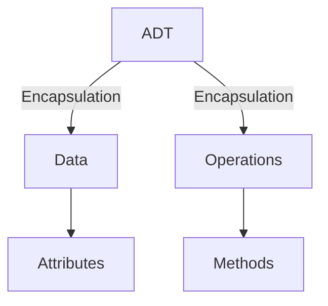
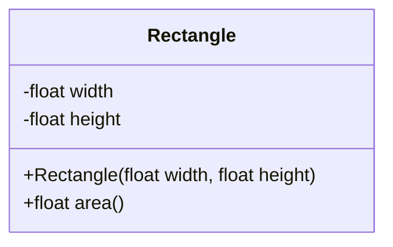

# Data Structures

## Lecture 1: Crash Course in Python

CHEN Zhongpu, Fall 2025

<div class="text-10px">
School of Computing and Artificial Intelligence, SWUFE
</div>
<div class="flex justify-center items-center h-60px mt-8px">
    
</div>

---

# How to Learn Python

## Basic <arcticons-123 />

- Chapter 1: Python Primer
- [The Python Tutorial](https://docs.python.org/3/tutorial/index.html)
- [Python Crash Course, 3rd Edition](https://book.douban.com/subject/36235056/)

## Advanced <arcticons-chess-pgn-master-pro />

- [Fluent Python, 2nd Edition](https://book.douban.com/subject/34990079/)
- [Effective Python](https://book.douban.com/subject/26709315/)
- [Python Cookbook](https://book.douban.com/subject/26381341/)

---

# 1. Solving Problems in Python

All questions are from _Data Structures & Algorithms in Python_:

- Write a short Python function, `is_multiple(n, m)`, that takes two integer
  values and returns `True` if n is a multiple of `m`, that is, `n = mi` for some
  integer `i`, and `False` otherwise.

- Write a short Python function, `minmax(data)`, that takes a sequence of
  one or more numbers, and returns the smallest and largest numbers, in the
  form of a tuple of length two. Do not use the built-in functions `min` or
  `max` in implementing your solution.

- Write a short Python function that takes a positive integer `n` and returns
  the sum of the squares of all the odd positive integers smaller than `n`.

- Demonstrate how to use Python’s list comprehension syntax to produce
  the list `[1, 2, 4, 8, 16, 32, 64, 128, 256]`.

---

# 2. Python Basic Built-in Data Structures

- `str`
- `list`
- `set`
- `dict`
- `tuple`

Please read Chapter 1-5, and Chapter 8, in official [Python Tutorial](https://docs.python.org/3/tutorial/index.html) <logos-python />.

## Example: Library Catalog <arcticons-pocketbook />

Suppose you are going to develop a library catalog system, and you need to maintain the ISBNs of books. The major operations is to check whether a book is in the library.

Which data structure would you use?

---

# 3. Object-oriented Programming in Python

> Everything is an object in Python.

> Please read [9. Classes](https://docs.python.org/3/tutorial/classes.html). Note that it is worth reading it throughout the course.

The simple `1 + 1` is indeed a method in class `int`:

```python
class int:
  def __add__(self, other):
    return self + other
```

## OOP Example <flat-color-icons-electronics />

```python
class MyClass:
    """A simple example class"""
    def __init__(self):
        self.value = "hello world"

    def f(self):
        return self.value

m = MyClass()
print(m.f())
```

---

## Abstract Data Type (ADT) <arcticons-lego-builder />

<div class="grid grid-cols-12">
  <div class="col-span-7">

> The notion of `abstraction` is to distill a complicated system to its most fundamental parts.

You do not need to know how a data type is implemented in order to be able to use it.

  </div>
  <div class="col-span-5">



  </div>
</div>

### ADT Example <arcticons-data-monitor />

<div class="grid grid-cols-12">
  <div class="col-span-6">
Consider a rectangle data type, and it provides a method to return its area.

<ul>
      <li>Compute the area on-the-fly</li>
      <li>Store the area in an attribute</li>
</ul>

  </div>

  <div class="col-span-6">



  </div>
</div>

---

## Exercise <arcticons-openai-chatgpt />

Write a Python class `MyList` holding a collection of integers, and implement the following methods:

- add an integer to the list.
- get the length of the list.
- get the value at a given index.

## Magic Methods <arcticons-magic />

To write Pythonic code, you need to understand [special/magic methods](https://realpython.com/python-magic-methods/), a.k.a., `dunder methods`. For example,

| Magic Method | Description                               |
| ------------ | ----------------------------------------- |
| `__init__()` | Provides an initializer in Python classes |
| `__len__()`  | Support the `len()` function              |

---

## Example: [vector2d.py](https://github.com/ChenZhongPu/data-structure-swufe/blob/master/code/python/start/vector2d.py) <logos-python />

```python

Addition:

    >>> v1 = Vector(2, 4)
    >>> v2 = Vector(2, 1)
    >>> v1 + v2
    Vector(4, 5)

Multiplication:
    >>> v = Vector(2, 4)
    >>> 3 * v
    Vector(6, 12)

Abs:
    >>> v = Vector(3, 4)
    >>> abs(v)
    5.0
```

---

# 4. Tools (Optional)

<div class="grid grid-cols-12">
<div class="col-span-5">

### [black](https://pypi.org/project/black/): for code formatting

  <a href="https://pypi.org/project/black/">
    
  </a>

```python
def   messy_add( x ,y ) :
  sum= x+y
  if sum> 10:
     print( "Sum is greater than 10" )
  else:print("Sum is 10 or less")
  for i in range(3):print( "i is" ,i )

```

</div>

<div class="col-span-4">

### [pytest](https://pypi.org/project/pytest/): for unit testing


</div>

<div class="col-span-3">

### [doctest](https://docs.python.org/3/library/doctest.html): for testing in docstring

```python
def add(a, b):
    """
    >>> add(1, 2)
    3
    """
    return a + b
```

</div>
</div>

## Linter and Formatter <flat-color-icons-support />

IDEs like PyCharm <logos-pycharm /> and VSCode <logos-visual-studio-code />(with Python extension) provide _linter_ (e.g., [ruff](https://github.com/astral-sh/ruff), `flake8`) and _formatter_ (e.g., `ruff`, `black`) out of box.

---

# Tasks in this week

## Teamwork <arcticons-microsoft-teams />

- Form a team of 3-5 members. Send TA the team members' names and student IDs by next **Thursday**. BTW, _a good catch team name is recommended_.

## Bonus <arcticons-bahnbonus />

- Efficiency is important for programming. Please figure out how to measure the running time of [max-sum](https://github.com/ChenZhongPu/data-structure-swufe/tree/master/code/python/alg/max-sum) from both empirical and theoretical perspectives. Send me an email with your findings by next **Sunday**. (Optional)
