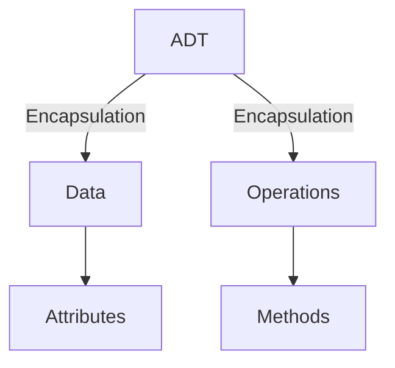

# Data Structures

## Lecture 1: Crash Course in Python

CHEN Zhongpu, Fall 2024

<div class="text-10px">
School of Computing and Artificial Intelligence, SWUFE
</div>
<div class="flex justify-center items-center h-60px mt-8px">
    
</div>

---

# 1. Solving Problems in Python

All questions are from _Data Structures & Algorithms in Python_:

- Write a short Python function, `is_multiple(n, m)`, that takes two integer
  values and returns `True` if n is a multiple of `m`, that is, `n = mi` for some
  integer `i`, and `False` otherwise.

- Write a short Python function, `minmax(data)`, that takes a sequence of
  one or more numbers, and returns the smallest and largest numbers, in the
  form of a tuple of length two. Do not use the built-in functions `min` or
  `max` in implementing your solution.

- Write a short Python function that takes a positive integer `n` and returns
  the sum of the squares of all the odd positive integers smaller than `n`.

- Demonstrate how to use Python’s list comprehension syntax to produce
  the list `[1, 2, 4, 8, 16, 32, 64, 128, 256]`.

---

# 2. Python Basic Built-in Data Structures

- `str`
- `list`
- `set`
- `dict`
- `tuple`

Please read Chapter 1-5, and Chapter 8, in official [Python Tutorial](https://docs.python.org/3/tutorial/index.html) <logos-python />.

---

# 3. Object-oriented Programming in Python

> Everything is an object in Python.

> Please read [9. Classes](https://docs.python.org/3/tutorial/classes.html). Note that it is worth reading it throughout the course.

The simple `1 + 1` is indeed a method in class `int`:

```python
class int:
  def __add__(self, other):
    return self + other
```

## ADT in OOP <flat-color-icons-electronics />

<div class="grid grid-cols-12">

  <div class="col-span-6">

```python
class MyClass:
    """A simple example class"""
    i = 12345

    def f(self):
        return 'hello world'
```

  </div>
  <div class="col-span-6">



  </div>
</div>

---

## Exercise <logos-openapi-icon />

Write a Python class `MyList` holding a list of integers, and implement the following methods:

- add an integer to the list.
- get the length of the list.
- get the value at a given index.

---

# 4. Tools

<div class="grid grid-cols-12">
<div class="col-span-7">

### [black](https://pypi.org/project/black/): for code formatting

  <a href="https://pypi.org/project/black/">
    
  </a>

```python
def   messy_add( x ,y ) :
  sum= x+y
  if sum> 10:
     print( "Sum is greater than 10" )
  else:print("Sum is 10 or less")
  for i in range(3):print( "i is" ,i )

```

</div>

<div class="col-span-5">

### [pytest](https://pypi.org/project/pytest/): for unit testing


</div>
</div>

## Linter and Formatter <flat-color-icons-support />

IDEs like PyCharm <logos-pycharm /> and VSCode <logos-visual-studio-code />(with Python extension) provide _linter_ (e.g., [ruff](https://github.com/astral-sh/ruff), `flake8`) and _formatter_ (e.g., `ruff`, `black`) out of box.

---

# Book Club <flat-color-icons-reading />

- Three to five students will form a group, and study [5. Data Sntructures](https://docs.python.org/3/tutorial/datastructures.html) carefully.
- TA will ask each student one question related to [5. Data Structures](https://docs.python.org/3/tutorial/datastructures.html).
- Each student asks TA at least one question.

This task is expected to be done by Week 10.
