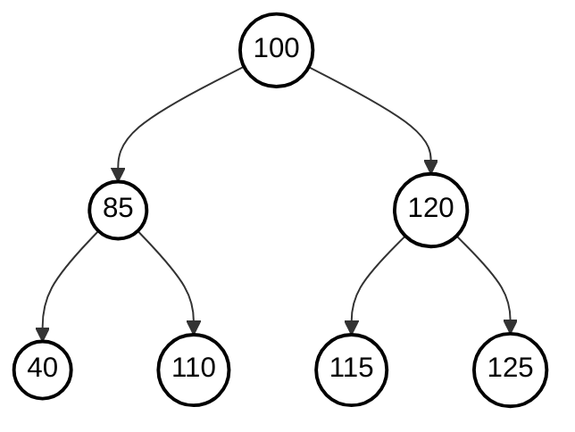

# Data Structures

## Lecture 10: Heap

CHEN Zhongpu, Fall 2024

<div class="text-10px">
School of Computing and Artificial Intelligence, SWUFE
</div>
<div class="flex justify-center items-center h-60px mt-8px">
    
</div>

---

## Review

1. What is the pre-order traversal of the following BST? And how about in-order?



2. Please draw the resulting tree after deleting 100.

---

# 0. Revisit Queue

A queue is a FIFO data structure. But if someone is a VIP, he/she can jump the queue. Therefore, the item with the <span class="text-red">highest priority</span> will be served first.

<div class="flex justify-center items-center">
    
</div>

<v-click>

## More examples in Operating System <logos-ubuntu />

Each process/application is assigned a priority. The operating system will schedule the process with the highest priority first.

- In a cellphone, the phone call (higher priority) is more important than the music player.
- In a computer, the less important task may be killed first if the resource is limited.

</v-click>

---

# 1. Priority Queue

As for a <span class="text-red">maximum priority queue</span>, it mainly supports two operations:

- `delMax()` (remove the maximum)
- `insert()`

<v-click>

## Elementary implementations <logos-element />

### (a) Unorderd array

- `insert()`: insert the element at the end.
- `delMax()`: find the largest element, and then remove it.

### (b) Ordered array

What about an ordered array?

Please analyze the time complexity.

</v-click>

---

## Elementary implementations <logos-element />

| Data Structure  | `insert()` | `delMax()` |
| --------------- | ---------- | ---------- |
| ordered array   | $O(N)$     | $O(1)$     |
| unordered array | $O(1)$     | $O(N)$     |

In this lecture, we will introduce a new data structure with guaranteed $O(\log N)$ in the worst case.

### Linked List <logos-qwik-icon />

What if we use a linked list as the underlying storage?

---

# 2. Heap

## Motivation <logos-mindsdb-icon />

The motivation is to design a <span class="text-red">partly</span> ordered data structure.

## heap-ordered <logos-freedomdefined />

A binary tree is <span class="text-red">heap-ordered</span> if the key in each node is larger than or equal to the keys in that node's two children (if any).

<logos-incident-icon/>Where is the maximum key?

<div class="flex justify-center items-center" v-click>
    
</div>

---

## 2.1 Complete Tree

Please try to understand the definition of a [complete tree](https://xlinux.nist.gov/dads/HTML/completetree.html) by yourself.

Which of the following are complete trees?

<div class="flex justify-center items-center">
    
</div>

---

## 2.2 Compact Array

We represent <span class="text-red">complete binary trees</span> sequentially within an array by putting the nodes in **level order**, with the root at position 1, its
children at positions 2 and 3, their children in positions 4, 5, 6 and
7, and so on.

<div class="flex justify-center items-center">
    
</div>

| i   | 0   | 1   | 2   | 3   | 4   |
| --- | --- | --- | --- | --- | --- |
|     |     | A   | B   | C   | D   |

---

## 2.2 Compact Array

<div class="grid grid-cols-12">
  <div class="col-span-5">
<div class="flex justify-center items-center">
    
</div>
  </div>

  <div class="col-span-7">

### Key findings <logos-aws-lightsail />

<ul>
  <li>The parent of the node in position k is position floor(k/2).</li>
  <li>The children of the node in position k are in positions 2k and 2k+1.</li>
</ul>

  </div>

</div>

| i   | 0   | 1   | 2   | 3   | 4   |
| --- | --- | --- | --- | --- | --- |
|     |     | A   | B   | C   | D   |

<logos-incident-icon/>What is the advantage of using arrays to represent a complete binary tree? And why is position 0 unused?

---

## 2.3 Binary Heap

> A <span class="text-red">[binary heap](https://en.wikipedia.org/wiki/Binary_heap)</span> is a complete binary tree that satisfies the heap-ordered property.

- Shape property: a complete binary tree.
- Heap property: the key in each node is larger than or equal to the keys in that node's two children (if any).

### Height of a heap <logos-highcharts />

The height of a heap of size $N$ is $\lfloor \log N \rfloor$.

<v-click>

Binary heap is a data structure that can be used to implement a priority queue efficiently. For brevity, we will use heap when referring to a binary heap.

| Data Structure | `insert()`  | `delMax()`  |
| -------------- | ----------- | ----------- |
| heap           | $O(\log N)$ | $O(\log N)$ |

</v-click>

---

### Heap Operations: `insert()`

<div class="flex justify-center items-center">
    
</div>

It can be fixed by <span class="text-red">swim</span>(bottom-up reheapify), which is performed by swapping with its parent.

<div class="flex justify-center items-center">
    
</div>

---

### Heap Operations: `insert()`

<div class="flex justify-center items-center">
    
</div>

```python
def _swap(self, i, j):
    self._pq[i], self._pq[j] = self._pq[j], self._pq[i]

def _less(self, i, j):
    return self._pq[i] < self._pq[j]

def _swim(self, k):
    while k > 1 and self._less(k//2, k):
        self._swap(k//2, k)
        k //= 2

def insert(self, key):
    self._pq.append(key)
    self._swim(self.size())
```

<logos-incident-icon/> How to implement `size()`?

---

### Heap Operations: `delMax()`

<div class="flex justify-center items-center">
    
</div>

It can be fixed by <span class="text-red">sink</span> (top-down reheapify) by swapping with its child.

<div class="flex justify-center items-center">
    
</div>

---

### Heap Operations: `delMax()`

<div class="flex justify-center items-center">
    
</div>

```python
def _sink(self, k):
    while 2 * k <= self.size():
        j = 2 * k
        if j < self.size() and self._less(j, j + 1):
            j += 1
        if not self._less(k, j):
            break
        self._swap(k, j)
        k = j

def del_max(self):
    if self.is_empty():
        raise NoElement
    root = self._pq[1]
    self._swap(1, self.size())
    self._pq.pop()
    self._sink(1)
    return root
```

---

## 2.4 Heap Construction

Given an array of $N$ items, how to construct a heap?

> Sink-based heap construction users fewer than $2N$ compares and fewer than $N$ exchanges.

```python
class MaxPQ:
    """A max binary heap."""

    def __init__(self, data=None):
        self._pq = []
        self._pq.append(None)  # append a dummy key at index 0
        if data is not None:
            self._pq.extend(data)
            n = len(data)
            for k in range(n // 2, 0, -1):
                self._sink(k)
```

The complete code can be found in [max_pq.py](https://github.com/ChenZhongPu/data-structure-swufe/blob/master/code/python/pq/max_pq.py).

---

## 2.5 Built-in Heap

Again, you don't need to implement a heap from the scratch. Python provides a built-in module `heapq`, which is a min heap.

```python
pq = []
heapq.heappush(pq, 1)
heapq.heappush(pq, 4)
heapq.heappush(pq, 0)
heapq.heappush(pq, 6)
heapq.heappush(pq, 3)
print(heapq.heappop(pq)) # 0
print(pq[0]) # 1
```

<logos-incident-icon/> How to use `heapq` to implement a max heap? For simplicity, assume keys are integers.

<v-click>

```python
class MaxPQ:
    def __init__(self):
        self._pq = []

    def insert(self, e):
        heapq.heapush(self._pq, -e)

    def delMax(self):
        return -heapq.heappop(self._pq)
```

</v-click>

---

## 2.6 Heap Application

Recall when building a [Huffman tree](https://github.com/ChenZhongPu/data-structure-swufe/blob/master/code/python/pq/huffman.py), we need to choose two smallest trees. Therefore, we can use a heap to store the trees.

```python
class HuffmanNode:
    def __init__(self, char, freq):
        self.char = char
        self.freq = freq
        self.left = None
        self.right = None

    def __lt__(self, other):
        return self.freq < other.freq

def build_huffman_tree(freq_dict):
    """Build Huffman tree using heapq for efficient selection."""
    heap = [HuffmanNode(char, freq) for char, freq in freq_dict.items()]
    heapq.heapify(heap)

    while len(heap) > 1:
        left = heapq.heappop(heap)
        right = heapq.heappop(heap)

        parent = HuffmanNode(None, left.freq + right.freq)
        parent.left = left
        parent.right = right

        heapq.heappush(heap, parent)

    return heap[0] if heap else None
```

---

## Summary

- Priority queue
- Queue
- Swim and sink in heap
