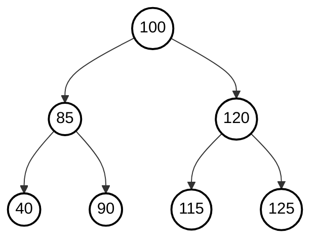

# Data Structures

## Lecture 12: Graph

CHEN Zhongpu, Fall 2025

<div class="text-10px">
School of Computing and Artificial Intelligence, SWUFE
</div>
<div class="flex justify-center items-center h-60px mt-8px">
    
</div>

---

# Motivation

Trees are used to represent <span class="text-red-500">hierarchical</span> structures, but not all relationships are hierarchical. For example:

- Maps
- Social networks
- Web pages

<div class="flex justify-center items-center">
    
</div>

---

# 1. Graph

### Definition <logos-freedomdefined />

> A graph is a set of `vertices` (/ˈvɝː.t̬e.siːz/) and `edges` that each connect a pair of vertices.

By convention, we use the names `0` through `V-1` for the vertices in a `V`-vertex (`/'vɝː.t̬eks/`) graph.

<div class="flex justify-center items-center">
    
</div>

### Anomalies <logos-analog />

- A **self-loop** is an edge that connects a vertex to itself.
- Two edges that connect the same pair of vertices are called **parallel edges**.

<div class="flex justify-center items-center">
    
</div>

---

## 1.1 Glossary

<div class="flex justify-center items-center">
    
</div>

Where there is an edge connecting two vertices, we say that the vertices are `adjacent` to one another and that the edge is `incident` to both vertices. The `degree` of a vertex is the number of edges incident to it.

A `subgraph` is a subset of a graph's edges (and associated vertices) that constitutes a graph.

---

## 1.1 Glossary

A `path` in a graph is a sequence of vertices connected by edges. A `simple path` is one with no repeated
vertices. A `cycle` is a path with at least one edge whose first
and last vertices are the same. The `length` of a path or a cycle is its number of edges.

<div class="flex justify-center items-center">
</div>

<div class="grid grid-cols-12">
  <div class="col-span-6">
    
  </div>
  <div class="col-span-6">
We say that one vertex is connected to another if there exists a path that contains both of them

> A graph is `connected` if there is a path from every vertex to every other
> vertex in the graph. A graph that is not connected consists of a set of `connected components`, which are maximal connected subgraphs.

  </div>
</div>

---

## 1.2 Quiz

Which of the following statements are true?

- A tree is a graph.
- If a graph with `V` vertices has `V-1` edges, it must be a tree.
- If a graph with `V` vertices has `V-1` edges and is connected, it must be a tree.
- If a graph with `V` vertices has `V-1` edges and is acyclic, it must be a tree.



---

## 1.3 Undirected Graphs ADT

In this course, we mainly focus on three types of graphs: 1) Undirected graphs; 2) Directed graphs (`digraphs`); 3) Weighted graphs.

### Undirected graph APIs <logos-fastapi-icon />

| Method          | Description                             |
| --------------- | --------------------------------------- |
| `Graph(V)`      | create an empty graph with `V` vertices |
| `V()`           | number of vertices                      |
| `E()`           | number of edges                         |
| `addEdge(v, w)` | add an edge between `v` and `w`         |
| `adj(v)`        | vertices adjacent to `v`                |

---

## 1.4 Graph Representation

Basically, there are two ways to represent a graph:

- <span class="text-red">Adjacency matrix:</span> use a $V \times V$ matrix to represent the graph.
- <span class="text-red">Adjacency list</span>: each vertex has a _list_ of adjacent vertices.

<div class="flex justify-center items-center">
    
</div>

Please draw the adjacency matrix and adjacency list for the graph above.

---

### Complexity Analysis <logos-codium-icon />

| Underlying data structure                      | Space | Add edge | Check adjacency |
| ---------------------------------------------- | ----- | -------- | --------------- |
| <span class="text-red">Adjacency matrix</span> | $V^2$ | $1$      | $1$             |
| <span class="text-red">Adjacency list</span>   | $E+V$ | $1$      | $V$             |

---

### Code <logos-visual-studio-code />

Try to answer the following questions:

- When using adjacency-list representation, how to represent the edges in Python?
- Based on the first observation, how to implement the `addEdge` method?

The code can be found in [undirected_graph.py](https://github.com/ChenZhongPu/data-structure-swufe/blob/master/code/python/graph/undirected_graph.py).

<v-click>

### NetworkX <logos-nanonets />

> [NetworkX](https://networkx.org/) is a Python package for the creation, manipulation, and study of the structure, dynamics, and functions of complex networks.

```python
import networkx as nx
import matplotlib.pyplot as plt

if __name__ == "__main__":
    adj = {0: (6, 2, 5, 1), 1: (0,), 2: (0,),
        3: (4, 5), 4: (5, 6, 3),
        5: (3, 4, 0), 6: (0, 4),}
    G = nx.Graph(adj)
    nx.draw(G, with_labels=True, font_weight="bold")
    plt.savefig("Graph.png", format="PNG")
```

</v-click>

---

# 2. Search in Graph

<div class="flex justify-center items-center">
    
</div>

How to find a path from one vertex to another in a graph? For example, [Six Degrees of Kevin Bacon](https://en.wikipedia.org/wiki/Six_Degrees_of_Kevin_Bacon).


<div class="grid grid-cols-12">
  <div class="col-span-4">
        <div class="flex justify-center items-center">
            
        </div>
  </div>
  <div class="col-span-8">

> Given $G = (V, E)$ and the source vertex $s \in V$, find all vertices reachable from $s$.

    While there is an edge (v, w) 
            with v visited and w not visited:
        - Choose such an edge (v, w) // the exploration step
        - Mark w as visited.
  </div>

</div>


---

## 2.1 Depth-First Search

> Depth-first search (DFS) is an algorithm for traversing or searching tree or graph data structures. The algorithm starts at the root node (selecting some arbitrary node as the root node in the case of a graph) and explores **as far as possible** along each branch before **backtracking**.

As for a binary tree, DFS is, in fact, a pre-order traversal.

<div class="flex justify-center items-center">
    
</div>

---

### Example <logos-bunny-net-icon />

<div class="flex justify-center items-center">
    
</div>

### Algorithm <logos-arc />

<div class="grid grid-cols-12">
  <div class="col-span-6">

  <ul>
<li>
To visit a vertex, mark it as visited.
      </li>
      <li>
Recursively visit all unmarked vertices adjacent to the current vertex.
        </li>
  </ul>

  </div>
  <div class="col-span-6">

```python
class Search:
    def __init__(self, g: Graph, s):
        self._marked = [False] * g.v()
        self._count = 0
        self.dfs(g, s)

    def dfs(self, g: Graph, v):
        self._marked[v] = True
        self._count += 1
        for w in g.adj(v):
            if not self._marked[w]:
                self.dfs(g, w)
```

  </div>
</div>

---

### Detailed Trace of DFS <logos-dynatrace-icon />

P.533 in _Algorithms, 4th_.

<div class="flex justify-center items-center">
    
</div>

---

### Checking Connectivity using DFS <logos-amazon-connect />

<div class="flex justify-center items-center">
    
</div>

- How to design an algorithm to check whether two vertices are connected?
- How many connected components are there in the graph?

```python
def connected_components(graph, n):
    visited = [False] * n
    connected_components = 0
    for node in range(n):
        if not visited[node]:  # Start a new DFS if the node is not visited
            dfs(node)
            connected_components += 1  # Increment the count for a new component
    return connected_components
```

> DFS uses pre-processing time and space proportional to $|V| + |E|$ to support constant-time connectivity queries in a graph.

---

### Finding Paths using DFS <logos-apache-flink-icon />

If the two vertices are connected, how to find a path between them? This is called the <span class="text-red">single-source path problem</span>, which fundamental to graph processing.

```python
class Paths:
    def __init__(self, g, s):
      pass

    def has_path_to(self, v):
      """is there a path from s to v?"""

    def path_to(self, v):
      """path from s to v; None if no such path"""
```

---

### edgeTo Array <logos-aurelia />

<div class="flex justify-center items-center">
    
</div>

To track the path, we can use `edgeTo` array in which `edgeTo[v]` means the last vertex on known path to `v`.

```python
def dfs(self, graph: Graph, v):
    self._marked[v] = True
    for w in graph.adj(v):
        if not self._marked[w]:
            self._edge_to[w] = v
            self.dfs(graph, w)
```

---

### edgeTo Array <logos-aurelia />

<div class="flex justify-center items-center">
    
</div>

```python
def path_to(self, v):
    if not self.has_path_to(v):
        return None
    path = []
    x = v
    while x != self._source:
        path.append(x)
        x = self._edge_to[x]
    path.append(self._source)
    return path
```

---

### Exercise <arcticons-exercisetimer />

> Given an undirected graph with `E` edges and `V` vertices, we run a DFS algorithm on it. Which of the following statements are true?

- The algorithm runs in $O(|E| + |V|)$ time.
- The paths discovered by the algorithm are the shortest paths.
- The paths discovered by the algorithm are the longest paths.
- The paths discoverer by the algorithm depend on the representations of the graph.

<div class="flex justify-center items-center">
    
</div>

---

## 2.2 Breadth-First Search

> It starts at the tree root and explores all of the neighbor nodes at the present depth prior to moving on to the nodes at the next depth level.

<div class="flex justify-center items-center">
    
</div>

As for a tree, it is also known as <span class="text-red">level-order</span> traversal.

<logos-browserling />Key Steps: After visiting `0`, `2`, `1`, and `5` are enqueued. Then, `2` is dequeued, and its neighbors `3` and `4` are enqueued.

---

### Algorithms <logos-arc />

<div class="flex justify-center items-center">
    
</div>

```python
def bfs(self, graph: Graph, s):
    q = queue()
    q.enqueue(s)
    self._marked[s] = True
    while queue:
        v = q.dequeue()
        for w in graph.adj(v):
            if not self._marked[w]:
                self._marked[w] = True
                self._edge_to[w] = v
                q.enqueue(w)
```

The code can be found in [breadth_first_paths.py](https://github.com/ChenZhongPu/data-structure-swufe/blob/master/code/python/graph/breadth_first_paths.py).

---

### BFS and Shortest Path <logos-arc />

> For any vertex $v$ reachable from $s$, BFS computes the shortest path from $s$ to $v$ (no paths from $s$ to $v$ has fewer edges).

**Proof**: It is easy to prove by induction that the queue always consists of zero or
more vertices of distance $k$ from the source, followed by zero or more vertices of
distance $k$ from the source, for some integer $k$, starting with $k$ equal to 0. This
property implies, in particular, that vertices enter and leave the queue in order of
their distance from `s`. When a vertex `v` enters the queue, no shorter path to `v` will
be found before it comes off the queue, and no path to `v` that is discovered after it
comes off the queue can be shorter than `v`’s tree path length.


<div class="grid grid-cols-12">
  <div class="col-span-4">
        <div class="flex justify-center items-center">
            
        </div>
  </div>
  <div class="col-span-8">


> TL;DR: Suppose $s$ is the source vertex, for $v \in V$, $l(v)$ is exactly the number of edges in the shortest path from $s$ to $v$ (i.e., $dist(s, v)$).

  </div>

</div>

> BFS takes time proportional to $|V| + |E|$ in the worst case.

---

## 2.3 Symbol Graph

Typical applications involve processing graphs defined in files or on web pages, using strings, not integer indices, to define and refer to vertices. In this case, we use a `symbol graph`.

<div class="flex justify-center items-center">
    
</div>

---

# Summary

- Graph
- Undirected Graph ADT
- DFS
- BFS
