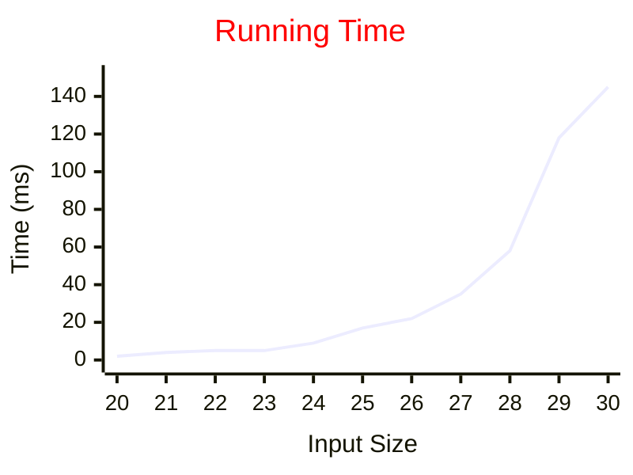
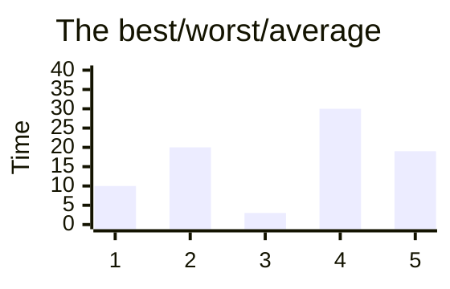
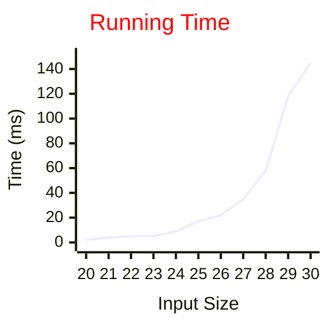

# Data Structures

## Lecture 2: Algorithm Analysis

CHEN Zhongpu, Fall 2024

<div class="text-10px">
School of Computing and Artificial Intelligence, SWUFE
</div>
<div class="flex justify-center items-center h-60px mt-8px">
    
</div>

---

# A Small Quiz

### 1. What does the following code snippet do?

```python
a = [1] * 10
```

```python
i, j = 10, 42
i, j = j, i
```

### 2. How to measure efficiency?

> A data structure is a data organization, and storage format that is usually chosen for <span class="text-red">efficient</span> access to data.

<v-click>

```python
import time
start = time.time()
# your program runs
end = time.time()
elapsed = end - start
```

- `time.perf_counter()` is recommended for measuring elapsed time due to its high resolution.
- [timeit](https://docs.python.org/3/library/timeit.html) is recommended measure execution time of small code snippets.

</v-click>

---

# 1. Empirical Analysis

<div class="grid grid-cols-12">

  <div class="col-span-6">

```python
import time

def fib(n):
    if n <= 1:
        return n
    return fib(n-1) + fib(n-2)

if __name__ == '__main__':
    ns = [20, 21, 22, 23, 24, 25, 26, 27, 28, 29, 30]
    with open('fib_python.txt', 'w') as f:
        for n in ns:
            start = int(round(time.time() * 1000))
            fib(n)
            end = int(round(time.time() * 1000))
            f.write(f'{n}   {end - start}\n')
```

  </div>

  <div class="col-span-6">



  </div>

</div>

---

## Which One is Faster? <arcticons-opentimer  />

`is_contains(lst_small, 42)` or `is_contains(lst_big, 42)`? We assume that `lst_small` is a short list, while `lst_big` is a long list.

```python
def is_contains(collection, target):
    for item in collection:
        if item == target:
          return True
    return False
```

## Focusing on the Worst Case <arcticons-trackworktime />

An algorithm may fun faster on some inputs than it does on others of the same size.

<div class="grid grid-cols-12">

  <div class="col-span-6">



  </div>

  <div class="col-span-6">
<ul>
      <li>The best case</li>
      <li class="text-red">The worst case</li>
      <li>The average case</li>
</ul>
  </div>

</div>

---

## Pitfalls of Empirical Analysis <arcticons-acm  />

- To compare different algorithms is feasible unless the hardware and software environments are the same.
- Experiments can be done only a limited set of test inputs.
- An algorithm must be fully implemented before the experiments.

## Mathematical Model <arcticons-microsoft-math />

$$T = f(n)$$

How long will my take, as a function of the input size (in the worst case)?

---

# 2. Mathematical Analysis

## [Knuth's](https://en.wikipedia.org/wiki/Donald_Knuth) Insight <arcticons-lightbulb />

The total running time of a program is determined by two primary factors:

1. The cost of executing each statement
2. The frequency of execution of each statement

$$total\ time = \sum{(cost \times frequency)}$$

<div class="grid grid-cols-12">

  <div class="col-span-6">

```python
def foo()
  i = 0
  result = i * (i + 1) + (i + 1) * (i + 2) + 42
```

  </div>

<div class="col-span-6">

```python
def bar(S):
  n = len(S)
  total = 0
  for j in range(n):
    total += S[j]
  return total
```

</div>

</div>

---

## Primitive Operations <arcticons-atomus />

We assume that <span class="text-red">primitive operations</span> take <span class="text-red">constant</span> time to execute, such as the following:

- Assigning an identifier to an object
- Performing an arithmetic operation (for example, _adding two numbers_)
- Comparing two numbers
- Accessing a single element of a Python with an identifier
- Calling a function (excluding operations executed within the function)
- Returning from a function

<!--
Instead of trying to determine the specific execution time of each primitive operations, we will simply count how many primitive operations are executed.
-->

---

## Building Complexity on Simplicity <arcticons-lego-builder />

Given a list `lst` whose size is `N`, how many primitive operations are there?

- `sum(lst)`
- `len(lst)`
- `lst.append(1)`
- `lst.append(2)`

---

## Order of Growth <arcticons-math-wiki />

We can simplify the cost model by taking a "big-picture" approach: it is the <span class="text-red">order of growth</span> (rate of growth) of the running time as a function of the input size. See plots at [Overleaf](https://www.overleaf.com/read/nxwsbwynfnbw#b2d378).

| Function              | Approximation | Oder of growth |
| --------------------- | ------------- | -------------- |
| $n^3/6 - n^2/2 + n/3$ | $n^3/6$       | $n^3$          |
| $n^2/2 - n/2$         | $n^2/2$       | $n^2$          |
| $2\lg{n} + 1$         | $2\lg{n}$     | $\lg{n}$       |
| 3                     | 3             | 1              |

- Ignores leading coefficient
- Ignores lower-order terms

---

# 3. Big O Notation

The order of growth is often described by an asymptotic notation <span class="text-red">big O</span>.

<!--
Informally, the term asymptotic means approaching a value or curve arbitrarily closely (i.e., as some sort of limit is taken).

f(x) = 1 - 1/x

-->

| Description  | Time complexity |
| ------------ | --------------- |
| constant     | $O(1)$          |
| logarithmic  | $O(\log{n})$    |
| linear       | $O(n)$          |
| linearithmic | $O(n\log{n})$   |
| quadratic    | $O(n^2)$        |
| cubic        | $O(n^3)$        |
| exponential  | $O(2^n)$        |

<!--
n-log-n function

polynomial function
-->

---

## Big O <arcticons-microsoft-math />

Suppose $f(x)$ and $g(x)$ are two functions defined on some subset of the real numbers. We write

$$f(x) = O(g(x))$$

if and only if there exists constants $N$ and $C$ such that

$$f(x) \leq Cg(x), \forall x > N$$

Intuitively, this means that $f$ does not grow faster than $g$ ($g$ is the <span class="text-red">upper bound</span> of $f$).

---

## Informal Big O <arcticons-emoji-eyes />

Big-O denotes the **less-than-or-equal-to** concept:

$$7n^3 + 100n^2 - 20n + 6$$

We can say its order of growth is $n^3$. To put it in another way, this function grows no faster than $n^3$, so we can write that it is $O(n^3)$. Note that in some research papers, it may be written in a fancy way, $\mathcal{O}(n^3)$.

<v-click>

## Examples: True or False <arcticons-exercisetimer />

- The function $8n + 5$ is $O(n)$.
- The function $n^2 + 2n + 1$ is $O(n^2)$.
- The function $5n^2 + 3n\log{n} + 2n + 5$ is $O(n^2)$.
- The function $8n + 5$ is $O(8n + 5)$.
- The function $8n + 5$ is $O(n^2)$.

</v-click>

<v-click>

We should use big-O in <span class="text-red">tightest and simplest</span> terms.

</v-click>

---

## Some Words of Caution <arcticons-foss-warn />

Does the following statement make sense?

- Since $n^2 - n = O(n^2)$ and $n^2 - 1 = O(n^2)$, we can say $n^2 - n = n^2 - 1$.
- An algorithm in $O(n)$ is always faster than one in $O(n^3)$.
- To search an item in an array, the time complexity is $O(1)$ in the best case.

<!--
f(n) = O(g(n)). This equality is only ONE-WAY.

A better way: f(n) is order of g(n).

It is also correct to say: f(n) \in O(g(n))
-->

---

## Examples <arcticons-emoji-newspaper />

Given a sequence $S$ consisting of $n$ numbers, we want to compute a sequence $A$ such that $A[j]$ is a <span class="text-red">prefix average</span>, that is

$$A[j] = \frac{\sum_{i=0}^{j}S[i]}{j + 1}$$

What is the time complexity of the following two algorithms?

<div class="grid grid-cols-12">

  <div class="col-span-6">

```python
def prefix_average_1(S):
  n = len(S)
  A = [0] * n
  for j in range(n):
    total = 0
    for i in range(j + 1):
      total += S[i]
    A[j] = total / (j + 1)
  return A
```

  </div>

  <div class="col-span-6">

```python
def prefix_average_2(S):
  n = len(S)
  A = [0] * n
  for j in range(n):
    A[j] = sum(S[0:j+1]) / (j + 1)
  return A
```

  </div>

</div>

---

# 4. Other Notations

A comprehensive about algorithm analysis is out of the scope of
this course.

- $\Theta(n)$
- $\Omega(n)$

<v-click>

## Revisit Fibonacci <arcticons-watchcheck />

<div class="grid grid-cols-12">

  <div class="col-span-6">

```python
def fib(n):
    if n <= 1:
        return n
    return fib(n-1) + fib(n-2)
```

The plot shows that its time complexity is $O(2^n)$.

  </div>

  <div class="col-span-6">



  </div>

</div>

<!--
gnuplot
set xrange [20:30]
plot 2**x
-->

</v-click>

---

# Conclusion

- Big O notation
- Evaluation through visualization

## Homework 2 <arcticons-pentastic />

- R-3.14
- R-3.25
- Plot the execution time as the function of $n$ for R-3.25.
