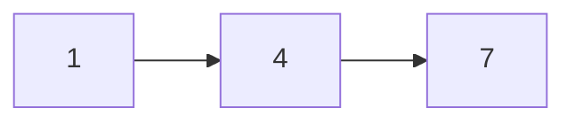
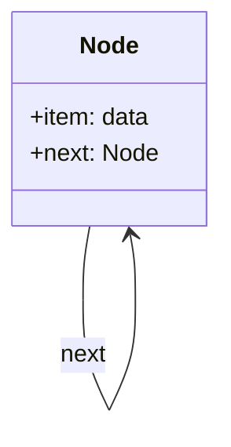
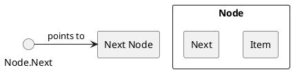

# Data Structures

## Lecture 5: Linked List

CHEN Zhongpu, Fall 2024

<div class="text-10px">
School of Computing and Artificial Intelligence, SWUFE
</div>
<div class="flex justify-center items-center h-60px mt-8px">
    
</div>

---

# Quiz

- A queue implements a LIFO policy. (True or False)
- What does `[None] * 10` do in Python?
- [Karatsuba algorithm](https://en.wikipedia.org/wiki/Karatsuba_algorithm) is a divide-and-conquer algorithm for fast multiplication of two numbers. Try to fix the bug in the following code.

```python
def karatsuba(x, y):
    x_str = str(x)
    y_str = str(y)
    if x == 0 or y == 0:
        return 0
    max_len = max(len(x_str), len(y_str))
    half_len = max_len // 2
    x_high = x // 10**half_len
    x_low = x % 10**half_len
    y_high = y // 10**half_len
    y_low = y % 10**half_len
    z0 = karatsuba(x_low, y_low)
    z1 = karatsuba(x_high, y_high)
    z2 = karatsuba(x_low + x_high, y_low + y_high)
    return (z1 * 10**(2 * half_len)) + ((z2 - z1 - z0) * 10**half_len) + z0
```

---

# 1. List ADT

List is an ordered collection (also known as a sequence).

- `add(e)`
- `remove(e)`
- `remove_at(i)`
- `get(i)`
- `set(i, e)`
- `size()`
- ...

---

## Revisit List <arcticons-lookofdisapproval />

`ArrayList` in Java and `list` in Python are both based on **arrays**. Therefore, the elements are stored in <span class="text-red">contiguous</span> memory locations.

<div class="flex justify-center items-center h-200px mt-8px">
    
</div>

<v-click>

### Pros and Cons <arcticons-myswordforandroid />

But, being contiguous is a double-edge sword.

- Efficient in many index-based operations (e.g., `get(i)`).
- Inefficient while shifting or copying (e.g., removing the 1st element).

</v-click>

---

# 2. Linked List

As for List ADT, there is yet another implementation, named **linked lists**, which are not contiguous in the memory.



<v-click>

### Formal Definition <arcticons-define />

> A linked list is a _recursive_ data structure that is either empty (null) or a reference to a node having an item and a reference to a linked list.

<div class="flex justify-center items-center h-140px mt-8px">
    

### Reference = Link = Pointer

</div>
  
As a result, we can use `head` to represent the linked list.

</v-click>

---

## Node in Linked List <arcticons-angry-birds />





<v-click>

```python
class Node:
    def __init__(self, item, next=None):
        self.item = item
        self.next = next

class LinkedList:
    def __init__(self, head=None):
        self.head = head
```

</v-click>

---

## Pseudo Code <arcticons-easy-coder />

The term **pseudo-code** refers to an informal, English-like notation for describing how an algorithm, a method, a class, or a program will work.

### Example

`indexOf(a, o)` returns the index of the first occurrence of the specified element `o` in array `a`, or -1 if `a` does not contain `o`.

<Latex>
<pre class="pseudocode">
\begin{algorithm}
  \caption{indexOf(arr, target)}
  \begin{algorithmic}
\FOR{$i = 0$ to $arr.size - 1$}
      \IF{$arr[i] == target$}
        \RETURN $i$
      \ENDIF
\ENDFOR
\RETURN $-1$
  \end{algorithmic}
\end{algorithm}
</pre>
</Latex>

---

### Exercise <arcticons-exercisetimer />

- Given a `head` of a linked list, how to check whether it is empty or not?

<Latex>
<pre class="pseudocode">
\begin{algorithm}
  \caption{isEmpty(head)}
  \begin{algorithmic}
  \Return $head == null$
  \end{algorithmic}
\end{algorithm}
</pre>
</Latex>

- Given a `head` of a linked list, how to get the size of it?

<Latex>
<pre class="pseudocode">
\begin{algorithm}
    \caption{size(head)}
    \begin{algorithmic}
            \State count $\gets$ 0
            \State current $\gets$ head
            \While{current $\neq$ null}
                \State count $\gets$ count + 1
                \State current $\gets$ current.next
            \EndWhile
            \Return count
    \end{algorithmic}
\end{algorithm}
</pre>
</Latex>

<arcticons-symbol-question-mark /> What is the time complexity of it? And how to implement it using recursion?

---

## search()

Given the `head` of a linked list, find the first node with item `k` in this list.

<Latex>
<pre class="pseudocode">
\begin{algorithm}
    \caption{search(head, k)}
    \begin{algorithmic}
    \State x $\gets$ head
    \While {x $\neq$ null and x.item $\neq$ k}
      \State x $\gets$ x.next
    \EndWhile
    \Return x
    \end{algorithmic}
\end{algorithm}
</pre>
</Latex>

<div class="flex justify-center items-center h-100px mt-8px">
    9->8"/>
</div>

<v-click>

<arcticons-symbol-question-mark /> How to implement `contains(head, k)` based on `search(head, k)`?

</v-click>

---

## addFirst()

To add an element at the beginning of the list. The core idea is to **create a new node whose `next` is the current head**, and then update `head` to this newly created node.

<div class="flex justify-center items-center h-200px mt-8px">
    
</div>

- Create a new node
- Set up the `next`
- Update the `head`

---

### Code

<Latex>
<pre class="pseudocode">
    \begin{algorithm}
      \caption{addFirst(head, item)}
      \begin{algorithmic}
          \State newNode $\gets$ Node(item)
          \State newNode.next $\gets$ head
          \State head $\gets$ newNode
      \end{algorithmic}
    \end{algorithm}
</pre>
</Latex>

```python
class Node:
    def __init__(self, item, next=None):
        self.item = item
        self.next = next

class LinkedList:
    def __init__(self, head=None):
        self.head = head
        self.size = 0
```

It can simplified into one line:

```python
head = Node(item, head)
```

---

## removeFirst()

To remove an element at the beginning in a list. The core idea is to **update the head to the second node**.

<div class="flex justify-center items-center h-200px mt-8px">
    
</div>

How do you think of the following code? <arcticons-abc-australia />

```python
head = head.next
```

---

### Pay Attention to Corner Cases <arcticons-warnwetter />

<Latex>
<pre class="pseudocode">
    \begin{algorithm}
      \caption{removeFirst(head)}
      \begin{algorithmic}
          \If{head == null} 
            \State raise an error (or do nothing)
          \EndIf
          \State head $\gets$ head.next
      \end{algorithmic}
    \end{algorithm}
</pre>
</Latex>

<v-click>

#### [Null References: The Billion Dollar Mistake](https://www.infoq.com/presentations/Null-References-The-Billion-Dollar-Mistake-Tony-Hoare/)

<div class="flex justify-center items-center h-220px mt-8px">
    
</div>

</v-click>

---

## addLast()

To add an element at the end of the list. The core idea is to **set tail's `next` to the newly created node**.

<div class="flex justify-center items-center h-200px mt-8px">
    
</div>

- Locate the `tail`
- Create a new node
- Set up tail's `next`

---

### Code

<Latex>
<pre class="pseudocode">
    \begin{algorithm}
      \caption{addLast(head, item)}
      \begin{algorithmic}
          \State current $\gets$ head
          \While{current.next $\neq$ null}
            \State current $\gets$ current.next
          \EndWhile
          \State current.next $\gets$ Node(item)
      \end{algorithmic}
    \end{algorithm}
</pre>
</Latex>

Think twice: what if the list is empty? <arcticons-abc-australia />

<v-click>

<Latex>
<pre class="pseudocode">
    \begin{algorithm}
      \caption{addLast(head, item)}
      \begin{algorithmic}
          \If{head == null}
            \State head $\gets$ Node(item)
            \Return
          \EndIf
          \State current $\gets$ head
          \While{current.next $\neq$ null}
            \State current $\gets$ current.next
          \EndWhile
          \State current.next $\gets$ Node(item)
      \end{algorithmic}
    \end{algorithm}
</pre>
</Latex>

</v-click>

---

### Revisit tail

What if we maintain a `tail` pointer in the linked list?

<div class="flex justify-center items-center h-160px mt-8px">
    
</div>

<div class="flex justify-center items-center h-200px mt-8px">
    9->8"/>
</div>

---

## removeLast()

To remove the element at the end of the list. The core idea is to **locate the second last node and set its `next` to `null`**.

<div class="flex justify-center items-center h-200px mt-8px">
    
</div>

- Locate the second last node `x`
- Update `x.next`

---

### Code

<Latex>
<pre class="pseudocode">
    \begin{algorithm}
      \caption{removeLast(head)}
      \begin{algorithmic}
          \If{head == null}
            \State raise an error (or do nothing)
          \EndIf
          \If{head.next == null}
            \State head $\gets$ null
            \Return
          \EndIf
          \State current $\gets$ head
          \While{current.next.next $\neq$ null}
            \State current $\gets$ current.next
          \EndWhile
          \State current.next $\gets$ null
      \end{algorithmic}
    \end{algorithm}
</pre>
</Latex>

---

### If tail is stored

<div class="flex justify-center items-center h-400px mt-8px">
    
</div>

---

# 3. Let's Write Code!

The complete code can be found at [linked_list.py](https://github.com/ChenZhongPu/data-structure-swufe/blob/master/code/python/lists/linked_list.py).

---

# 4. Linked List Based Stack/Queue

Given a singly linked list, the time complexity of common operations can be summarized as follows:

| Operation       | Time Complexity |
| --------------- | --------------- |
| `addFirst()`    | $O(1)$          |
| `removeFirst()` | $O(1)$          |
| `addLast()`     | $O(1)$          |
| `removeLast()`  | $O(n)$          |

<arcticons-symbol-question-mark /> Can you implement a stack and a queue based on the linked list?

---

# Summary

- Linked List
- Adding and removing elements on a linked list

## Homework 3

- Implement Stack/Queue based on a singly linked list.
- R-7.5 (assume that `size` attribute is not maintained)

(You must show me the screenshot of the code and the test output)
